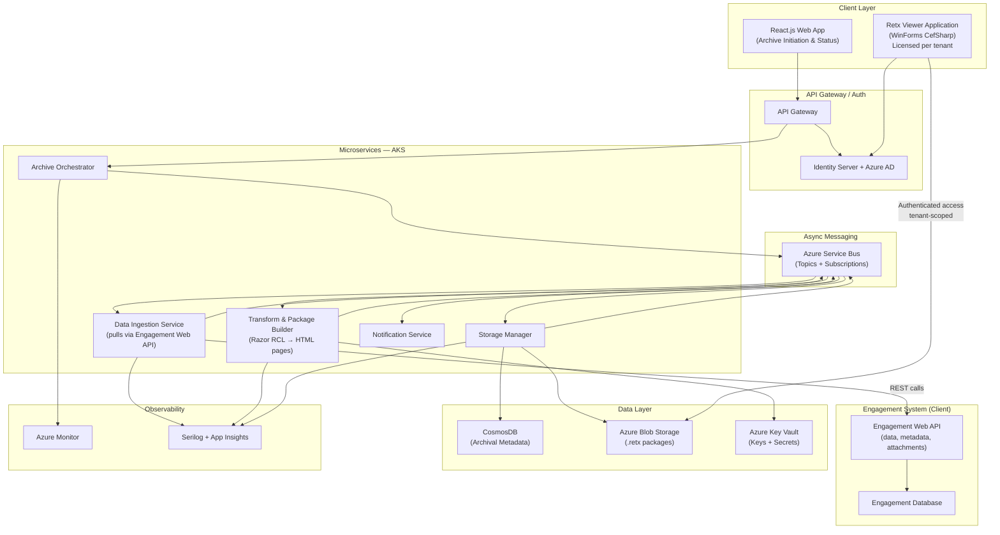
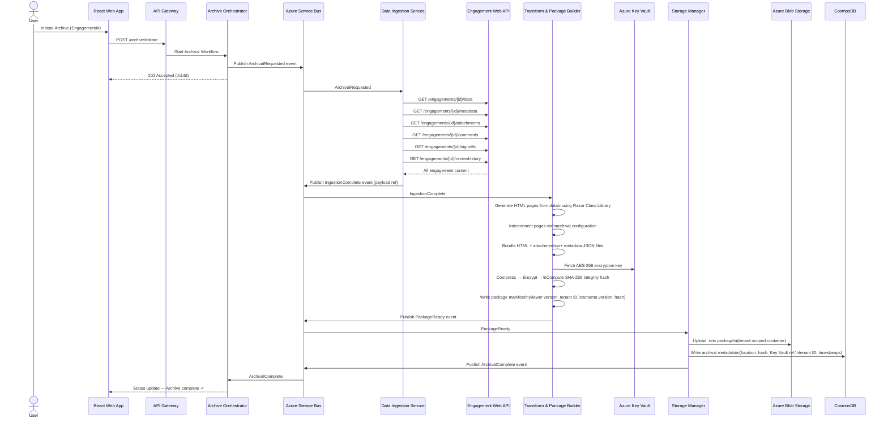
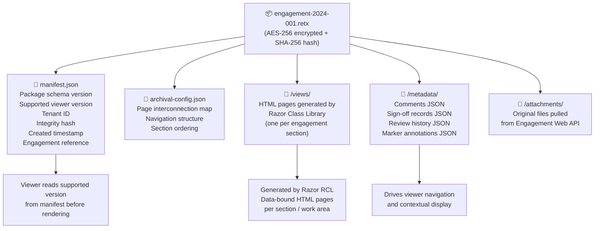
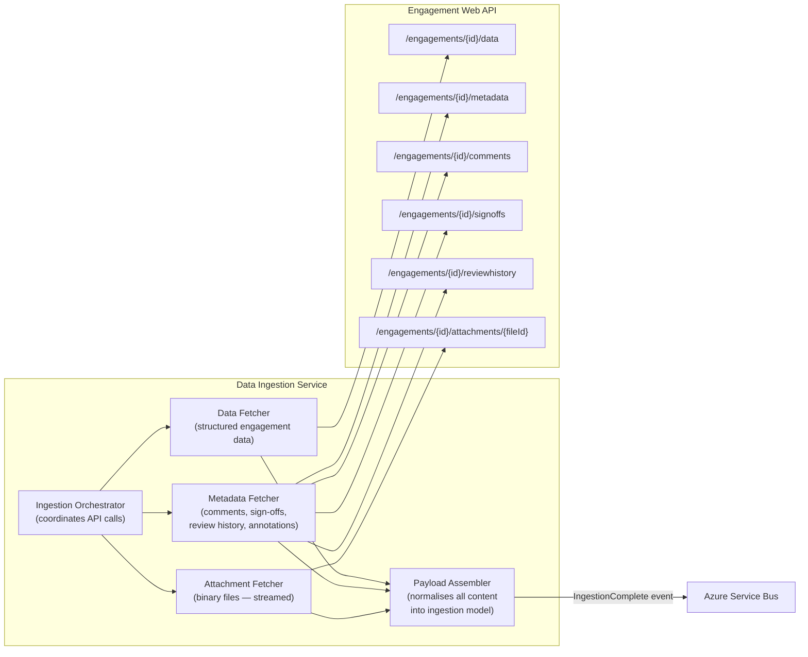
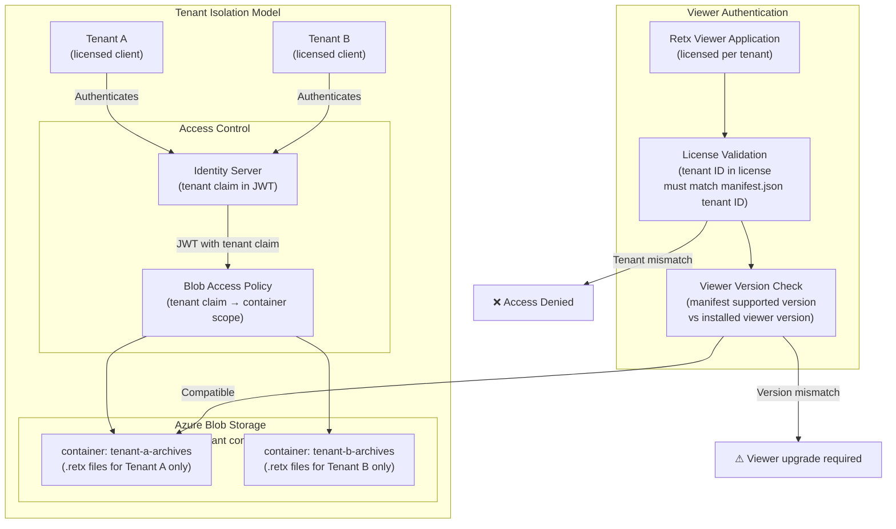
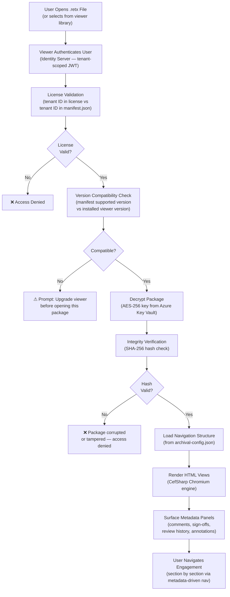
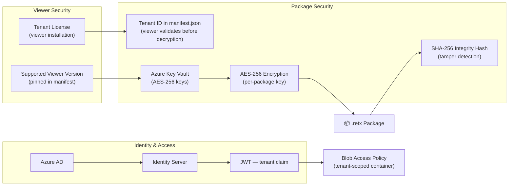

# Engagement Retention & Archiving Solution

> **Role:** Senior Technical Lead (Architect)
> **Domain:** Compliance & Regulatory Archival | Audit Management
> **Stack:** .NET 6 · C# · ASP.NET Web API · Microservices · AKS · Azure Service Bus · Azure Blob Storage · CosmosDB · SQL Server · Identity Server · Azure AD · Azure Key Vault · Razor Components (RCL) · React.js · WinForms · CefSharp · Docker · Serilog · Azure Monitor

---

## Overview

Designed and implemented a compliance-driven archival subsystem for an enterprise audit management platform. The solution preserves completed audit engagements in a portable, encrypted, cloud-stored format — enabling long-term retention and on-demand reproduction as mandated by government regulations.

The system pulls all engagement data through the engagement system's Web API, transforms it into a self-contained portable archive package (`.retx`), and stores it in Azure Blob Storage. A separate licensed viewer application — installed at the client/tenant level — reads `.retx` files and renders the engagement content with full navigation, metadata, annotations, sign-offs, and review history. Access to `.retx` files is strictly scoped to the tenant whose engagement system produced them.

---

## Problem Context

Audit firms operating under government-mandated retention policies had no automated mechanism to archive completed engagements. This resulted in:

- Completed engagements remaining in live databases and storage, inflating infrastructure costs and degrading performance over time.
- No portable, reproducible format for regulatory inspection or client review independent of the live system.
- Sensitive audit data persisting in active systems well beyond operational need, increasing security exposure.
- Manual, error-prone processes to reconstruct historical engagements on demand.
- No version-controlled viewer compatibility — no way to guarantee an archived engagement from years prior could still be correctly rendered.

---

## Goals & Non-Functional Requirements

| Requirement | Detail |
|---|---|
| Regulatory Compliance | Full engagement context preserved per government retention mandates |
| Portability | Self-contained `.retx` package — HTML views, attachments, and metadata bundled together |
| API-Driven Data Ingestion | All engagement data pulled exclusively through the engagement system's Web API — no direct database access |
| Security | AES-256 encryption, integrity validation, secrets via Azure Key Vault, tenant-scoped access control |
| Viewer Compatibility | Supported viewer version referenced in package metadata — viewer validates compatibility before rendering |
| Tenant Isolation | A licensed tenant can only access `.retx` files produced by their own engagement application |
| Live System Decoupling | Zero performance impact on active engagement workflows post-archival |
| Reproducibility | Any archived engagement reproducible on demand via the licensed viewer application |
| Scalability | Async, event-driven pipeline supporting batch and on-demand archival |

---

## Architecture

### High-Level System Architecture

---

### Archival Pipeline — Event-Driven Flow

---

### .retx Package Structure

The `.retx` package is a self-contained, encrypted archive. It does not contain a viewer — the viewer is a separate licensed application installed per tenant. The package contains everything needed to render the engagement once the viewer decrypts and opens it.

---

### Data Ingestion — API-Driven Pull

All engagement content is sourced exclusively through the Engagement System's Web API. The Data Ingestion Service has no direct access to the engagement database.

---

### Tenant Security & Access Control

---

### Viewer Application — How It Works

The Retx Viewer is a standalone licensed desktop application (WinForms + CefSharp). It is not bundled inside the `.retx` package — it is installed separately per tenant and updated independently of the archive packages.

---

### Security Architecture

---

## Key Technical Decisions

### API-Only Data Ingestion
The Data Ingestion Service has no direct connection to the engagement database. All content — structured data, metadata, comments, sign-offs, review history, and attachments — is pulled exclusively through the Engagement System's Web API. This decouples the archival system from the engagement database schema, ensures data access goes through the same authorisation layer as the rest of the platform, and means the archival system remains compatible across engagement application versions without schema-level coupling.

### Razor Class Library for HTML Page Generation
Engagement data pulled from the Web API is transformed into HTML pages by the Transform & Package Builder service using a Razor Class Library (build-time compiled). Each section of the engagement maps to a typed view model and a corresponding Razor template — producing structured, self-contained HTML pages that are interconnected within the package according to the archival configuration. Build-time compilation catches template errors at compile time and ensures type-safe binding between the ingestion model and the rendered output.

### Separate Licensed Viewer Application
The viewer is not embedded inside the `.retx` package. It is a separately installed, licensed desktop application (WinForms + CefSharp) distributed to and managed per tenant. This separation allows the viewer to be updated independently of archive packages — new viewer versions can improve rendering, add features, or patch security issues without modifying existing `.retx` files. The supported viewer version referenced in `manifest.json` ensures a package is only opened with a compatible viewer version.

### Tenant-Scoped Blob Containers
`.retx` files are stored in per-tenant Azure Blob Storage containers. Blob access policies are enforced via the tenant claim in the authenticated JWT — a user authenticated as Tenant A cannot access Tenant B's container regardless of knowing the blob URL. The tenant ID is also embedded in `manifest.json` and validated by the viewer at open time before decryption is attempted.

### Viewer Version Pinning in Manifest
Each `.retx` package records the minimum supported viewer version in `manifest.json`. When a user opens a package, the viewer compares this value against its installed version. If the installed viewer is older than the required version, the user is prompted to upgrade before the package is decrypted. This prevents rendering failures or data loss from version mismatches on long-term archived packages.

---

## Challenges & Solutions

| Challenge | Solution |
|---|---|
| Engagement Web API rate limiting under batch archival load | Ingestion Service implements configurable throttling with exponential backoff; batch archival jobs run during off-peak windows to avoid contention with live engagement users |
| Large attachment files causing memory pressure during ingestion | Attachments streamed directly from the Engagement API to temporary storage using chunked HTTP reads — never fully materialised in service memory |
| Ensuring archived HTML pages render correctly across future viewer versions | Viewer version pinned in `manifest.json`; viewer validates compatibility before decryption; viewer upgrade prompt prevents rendering against unsupported package formats |
| Tenant ID spoofing attempts (opening another tenant's .retx) | Tenant ID validated at two independent layers — Blob access policy (JWT tenant claim) and viewer license check (license tenant ID vs manifest tenant ID); both must pass before decryption |
| Archival configuration determining page interconnection complexity | Archival configuration stored as a versioned JSON schema in `archival-config.json` inside the package; configuration drives the viewer's navigation tree without hardcoding structure in the viewer application |
| SHA-256 integrity verification on multi-GB packages | Hash computed incrementally using streaming reads during package build — no full in-memory load required; verified on open using the same streaming approach in the viewer |

---

## Outcomes

| Area | Result |
|---|---|
| Compliance | 100% of government-mandated retention requirements fulfilled |
| Live System Impact | Zero performance degradation — data pulled via API asynchronously, fully decoupled from live workflows |
| Security | Per-tenant container isolation + JWT enforcement + license validation + AES-256 encryption |
| Portability | Any archived engagement openable on demand via the licensed viewer without live system access |
| Viewer Compatibility | Version pinning in manifest prevents rendering failures on long-term archived packages |
| Tenant Isolation | Strict two-layer tenant validation — no cross-tenant data access possible |

---

## Patterns Applied

| Pattern | Application |
|---|---|
| **Choreography-based Saga** | Multi-step archival pipeline coordinated via Service Bus events — no central state machine |
| **API Gateway (Data Ingestion)** | All engagement content accessed through Web API — no direct database coupling |
| **Event-Driven Architecture** | Each pipeline stage reacts to domain events, fully decoupled from producers |
| **Content-Addressable Storage** | SHA-256 hash as the canonical integrity identifier for each `.retx` package |
| **Secrets Externalisation** | Azure Key Vault via pipeline — no secrets in code, config, or container images |
| **Tenant Isolation** | Per-tenant Blob containers + JWT claim enforcement + viewer license validation |
| **Version Compatibility Contract** | Supported viewer version embedded in package manifest — compatibility validated before decryption |
| **Domain-Driven Design** | Microservice boundaries aligned to ingestion, transformation, storage, and notification domains |