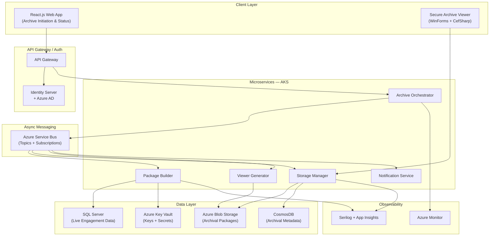
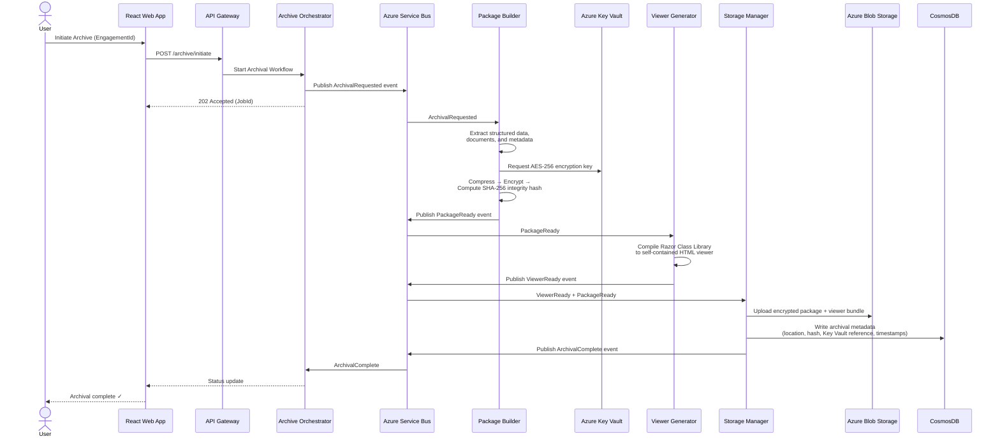
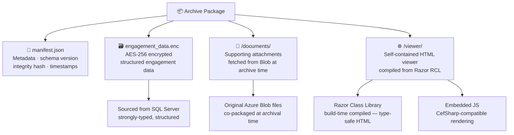
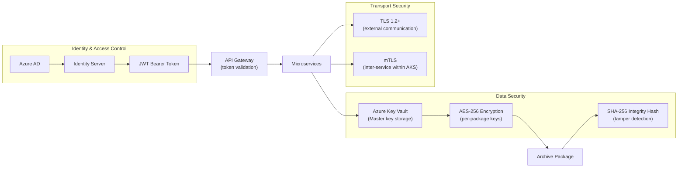
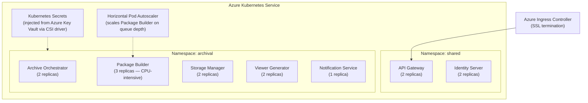

# Engagement Retention & Archiving Solution

> **Role:** Senior Technical Lead (Architect)
> **Domain:** Compliance & Regulatory Archival | Audit Management
> **Stack:** .NET 6 · C# · ASP.NET Web API · Microservices · Azure AKS · Azure Service Bus · Azure Blob Storage · CosmosDB · SQL Server · Identity Server · Azure AD · Azure Key Vault · Razor Components (RCL) · React.js · WinForms · CefSharp · Docker · Serilog · Azure Monitor

---

## Overview

Designed and implemented a compliance-driven archival subsystem for an enterprise audit management platform. The solution preserves completed audit engagements in a portable, encrypted, cloud-stored format — enabling long-term retention and on-demand reproduction as mandated by government regulations.

The system captures full engagement context — structured data, supporting documents, and metadata — packages it into a self-contained archival artifact with an embedded secure viewer, and decouples historical data from live systems. This reduced infrastructure load on active systems while ensuring regulatory compliance, audit traceability, and tamper-proof storage.

---

## Problem Context

Audit firms operating under government-mandated retention policies had no automated mechanism to archive completed engagements. This resulted in:

- Completed engagements remaining in live databases and storage, inflating infrastructure costs and degrading query performance over time.
- No portable, offline-reproducible format for regulatory inspection or client review.
- Sensitive audit data persisting in active systems well beyond operational need, increasing security exposure.
- Manual, error-prone processes to reconstruct historical engagements on demand.

---

## Goals & Non-Functional Requirements

| Requirement | Detail |
|---|---|
| Regulatory Compliance | Full engagement context preserved per government retention mandates |
| Portability | Self-contained archive package — data, documents, and viewer bundled together |
| Security | AES-256 encryption, integrity validation, secrets managed via Azure Key Vault |
| Live System Decoupling | Zero performance impact on active engagement workflows post-archival |
| Reproducibility | On-demand replay of any archived engagement via embedded secure viewer |
| Scalability | Async, event-driven pipeline supporting batch and on-demand archival |
| Observability | End-to-end traceability across pipeline stages with structured logging |

---

## Architecture

### High-Level System Architecture

---

### Event-Driven Archival Pipeline

The archival workflow is implemented as a **choreography-based saga** over Azure Service Bus. Each pipeline stage publishes a domain event on completion, triggering the next stage independently — no central orchestrator holds state between steps.

---

### Archive Package Structure

Each archival artifact is a self-contained, encrypted package. It bundles all engagement context together with an embedded viewer so it can be reproduced without any dependency on the live system.

---

### Security Architecture

Security is layered so that no single compromise exposes plaintext audit data. Encryption keys are never co-located with the data they protect.

> The encrypted archive package, the CosmosDB metadata record (holding the Key Vault reference), and the Key Vault key are stored and secured independently. Reproducing an engagement requires all three layers to be intact and authorised.

---

### AKS Deployment Topology

---

## Key Technical Decisions

### Razor Class Library for HTML Generation
The embedded viewer required generating structured, type-safe HTML from engagement data in a non-HTTP background service context. Runtime Razor compilation was evaluated but introduced overhead and runtime rendering failures. Build-time compiled RCL was adopted after performance validation — template errors are caught at compile time, view models are strongly typed, and the output integrates cleanly into the archive package.

### Azure Service Bus for Pipeline Orchestration
Archival is a multi-step, long-running workflow unsuitable for synchronous request-response handling. Azure Service Bus topics with per-service subscriptions enable each pipeline stage to operate independently and at its own pace. Built-in dead-letter queues, retry policies, and session-based ordering provide the resilience required for compliance-grade processing.

### CosmosDB for Archival Metadata
Archival metadata — package locations, Key Vault key references, integrity hashes, timestamps — has no relational dependencies but requires fast lookups by engagement ID across millions of records over multi-year retention windows. CosmosDB was chosen over SQL Server for its partition-aligned access pattern, schema flexibility as the system evolves, and TTL-based retention policy enforcement.

### Streaming Compression for Large Packages
Engagement packages with large document sets caused memory pressure when built in-memory. `System.IO.Compression` was used with chunked, streaming reads to build packages without loading entire datasets into memory, keeping Package Builder pods within resource limits during batch archival runs.

---

## Challenges & Solutions

| Challenge | Solution |
|---|---|
| Razor rendering in headless service context (no HTTP pipeline) | Moved from runtime Razor to build-time compiled RCL; viewer is rendered at build time and embedded as static HTML into the package |
| Service Bus message ordering across pipeline stages | Enabled Service Bus **sessions** keyed on `engagementId` to guarantee per-engagement message ordering across all subscribers |
| Integrity verification on long-term stored packages | SHA-256 hash computed at packaging time, persisted in CosmosDB; verified on every retrieval request before decryption |
| Viewer rendering consistency across OS environments | Embedded CefSharp (Chromium engine) in WinForms viewer — deterministic rendering independent of the host machine's installed browser |
| Microservices drifting toward distributed monolith | Strict service boundary rules enforced in architecture reviews; direct cross-service database access treated as architectural violations |

---

## Outcomes

| Area | Result |
|---|---|
| Compliance | 100% of government-mandated retention requirements fulfilled |
| Live System Impact | Zero performance degradation — fully async, decoupled pipeline |
| Security | No plaintext sensitive data at rest; all packages AES-256 encrypted with externally managed keys |
| Reproducibility | Any archived engagement reproducible on demand via the secure viewer |
| Infrastructure | Cold engagement data removed from live database and storage systems |
| Scalability | Package Builder auto-scales based on Service Bus queue depth during batch runs |

---

## Patterns Applied

| Pattern | Application |
|---|---|
| **Choreography-based Saga** | Multi-step archival pipeline coordinated via Service Bus events without a central state machine |
| **Event-Driven Architecture** | Each pipeline stage reacts to domain events, fully decoupled from producers |
| **Content-Addressable Storage** | SHA-256 hash as the canonical identifier for archive package integrity |
| **Secrets Externalisation** | Azure Key Vault via Kubernetes CSI driver — no secrets in code, config, or container images |
| **Domain-Driven Design** | Microservice boundaries aligned to business domains (packaging, storage, viewer generation) |
| **Clean Architecture** | Business logic isolated from infrastructure concerns within each service |