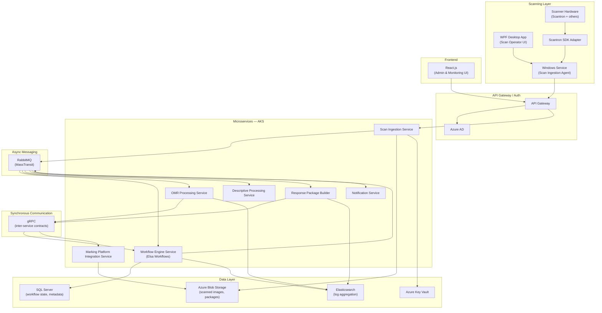
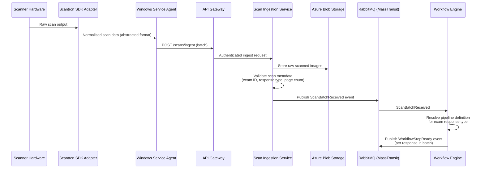
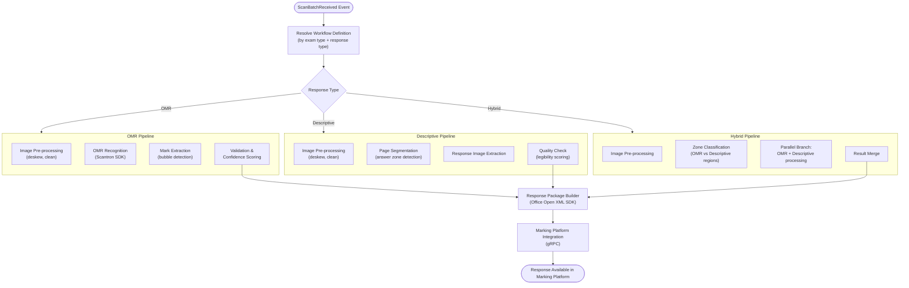
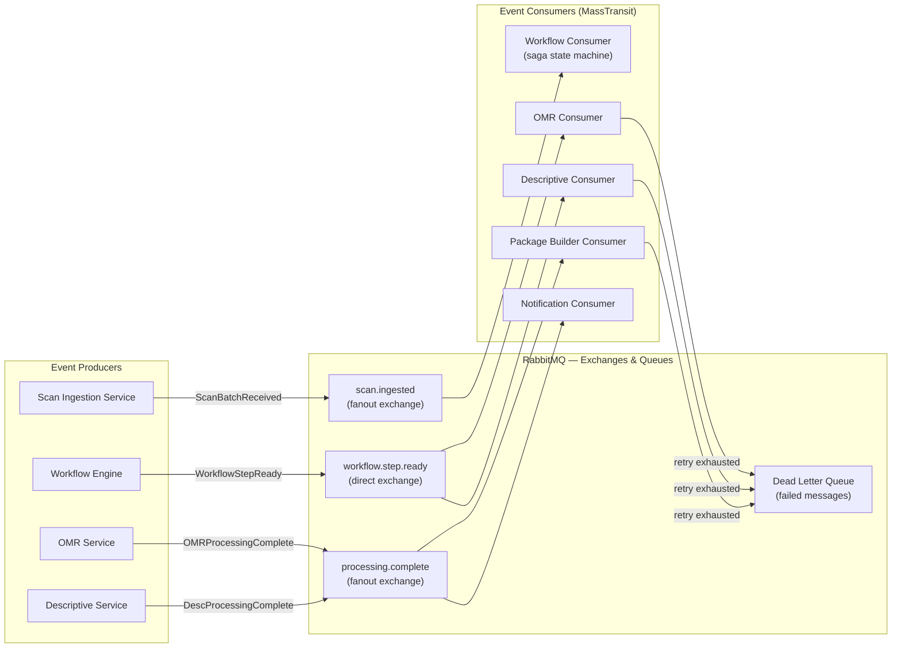
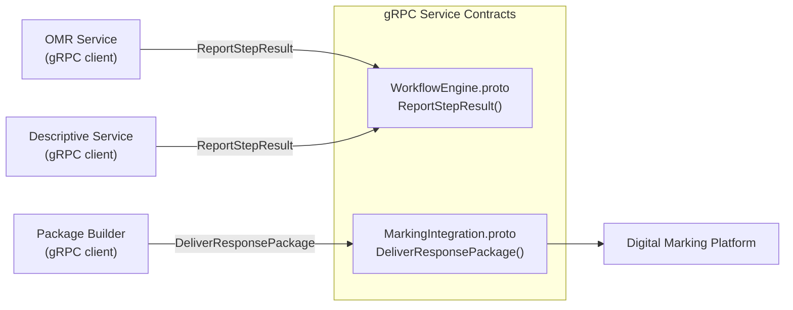
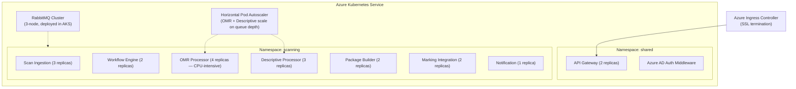
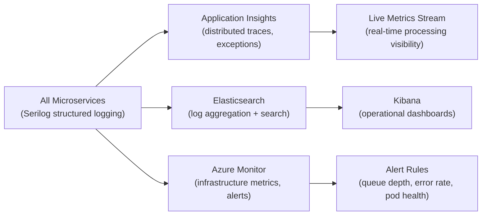

# Digital E-Marking Scanning Automation

> **Role:** Technical Lead
> **Domain:** EdTech · Exam Assessment · Document Processing Automation
> **Stack:** .NET 5 · ASP.NET Core · C# · Microservices · RabbitMQ · MassTransit · gRPC · Docker · AKS · Azure Blob Storage · Azure Key Vault · Azure AD · Elsa Workflows · Office Open XML SDK · Scantron SDK · React · WPF · Windows Services · Serilog · Elasticsearch · Azure Monitor · Application Insights · SQL Server

---

## Overview

Contributed to the architecture and led end-to-end development of a distributed microservices-based extension to an enterprise digital marking platform. The system enables universities to automate high-volume exam response scanning, configurable workflow processing, and seamless integration with downstream digital marking systems.

The solution supports multiple response types — OMR (Optical Mark Recognition), descriptive, and hybrid — with configurable processing pipelines, multi-scanner hardware integration, and fully asynchronous event-driven ingestion capable of handling large-scale exam runs without impacting live marking workflows.

---

## Problem Context

Universities conducting large-scale examinations faced significant bottlenecks in the transition from physical answer scripts to digital marking:

- Manual scanning operations were slow, error-prone, and lacked traceability across high-volume exam runs.
- No unified processing pipeline existed to handle different response types (OMR bubblesheets, written descriptive answers, and hybrid formats) within the same workflow.
- Integration between scanning hardware and digital marking platforms required custom, brittle point-to-point connectors with no standardisation.
- Synchronous processing models could not scale to handle peak exam periods without blocking downstream marking workflows.
- Operational visibility into scan ingestion, processing status, and failure rates was limited.

---

## Goals & Non-Functional Requirements

| Requirement | Detail |
|---|---|
| Response Type Support | OMR, descriptive, and hybrid exam response formats in a unified pipeline |
| Hardware Abstraction | Multi-scanner integration (including Scantron) via abstracted SDK layer |
| Scalability | Async event-driven ingestion for large-scale, concurrent scan processing |
| Configurability | Workflow pipelines configurable per exam type without code changes |
| Resilience | Fault-tolerant processing with retry, dead-letter, and requeue capabilities |
| Integration | Reliable downstream integration with the digital marking platform via gRPC |
| Observability | Structured logging, distributed tracing, and real-time operational dashboards |

---

## Architecture

### High-Level System Architecture

---

### Scan Ingestion Flow

---

### Configurable Workflow Pipeline (Elsa Workflows)

Each exam type is associated with a workflow definition configured in Elsa. The Workflow Engine resolves the correct pipeline at runtime — no code changes required to introduce new processing paths.

---

### Asynchronous Processing with RabbitMQ + MassTransit

---

### gRPC Service Contracts

gRPC is used for synchronous, contract-first communication between services where strong typing and performance matter — specifically for OMR result reporting back to the Workflow Engine and for delivering processed response packages to the Marking Platform Integration Service.

---

### AKS Deployment Topology

---

### Observability Stack

---

## Key Technical Decisions

### Elsa Workflows for Configurable Processing Pipelines
Different exam types require different processing steps in different orders. Hardcoding pipeline logic per response type would have required code changes and redeployments for every new exam configuration. Elsa Workflows was adopted to define processing pipelines as declarative workflow definitions stored in the database — the Workflow Engine resolves and executes the correct pipeline at runtime. New exam types are onboarded by configuring a workflow definition, not by modifying code.

### RabbitMQ + MassTransit for Async Ingestion
Scan ingestion during peak exam periods generates burst traffic that would overwhelm synchronous processing. RabbitMQ with MassTransit provides durable, backpressure-aware message queuing. MassTransit's saga state machine manages workflow step state across the multi-stage pipeline, and built-in retry and dead-letter policies ensure no scan is silently lost on transient failure.

### gRPC for Inter-Service Result Reporting
While RabbitMQ handles event-driven pipeline progression, some inter-service communication required synchronous, strongly-typed contracts — specifically OMR result reporting and response package delivery to the marking platform. gRPC was chosen for these paths for its protobuf-based contract enforcement, low latency, and bidirectional streaming capability for future extensibility.

### Scantron SDK Abstraction via Adapter Layer
Direct dependency on the Scantron SDK throughout the ingestion pipeline would have tied the entire system to a single hardware vendor. An adapter layer abstracts the SDK behind a normalised interface, allowing the Windows Service Agent to support multiple scanner types. Adding a new scanner model requires only a new adapter implementation — no changes to the ingestion pipeline.

### Office Open XML SDK for Response Package Generation
Processed exam responses need to be packaged in a format compatible with the downstream digital marking platform's document model. Office Open XML SDK was used to construct structured, standards-compliant response packages programmatically, ensuring compatibility without relying on Office automation or COM interop.

---

## Challenges & Solutions

| Challenge | Solution |
|---|---|
| Handling burst scan ingestion during peak exam periods | RabbitMQ queue-based buffering with HPA scaling OMR and Descriptive processor pods based on queue depth |
| Workflow state consistency across multi-step async pipeline | MassTransit saga state machine with SQL Server persistence — state survives pod restarts and redeployments |
| Scanner hardware producing inconsistent output formats | Scantron SDK Adapter normalises all scanner output to a consistent internal format before ingestion; hardware-specific logic is isolated to the adapter |
| OMR processing failures mid-batch affecting downstream marking | Dead-letter queue captures failed messages; failed scans are isolated and flagged for manual review without blocking the rest of the batch |
| Hybrid response pages requiring both OMR and descriptive processing | Workflow Engine branches the hybrid pipeline into parallel tracks (OMR + descriptive), waits for both to complete, and merges results before package building |
| Offshore deployment and integration stabilisation | Participated in on-site client implementation; documented integration contracts as gRPC proto definitions to eliminate ambiguity between teams |

---

## Outcomes

| Area | Result |
|---|---|
| Throughput | Large-scale exam batches processed asynchronously without impacting live marking workflows |
| Response Type Coverage | OMR, descriptive, and hybrid formats handled in a single unified pipeline |
| Configurability | New exam types onboarded via workflow configuration — zero code deployments required |
| Resilience | Failed scans isolated to dead-letter queues; no silent data loss on transient failures |
| Hardware Support | Multi-scanner integration via abstracted adapter layer; vendor lock-in eliminated |
| Observability | End-to-end pipeline visibility via structured logs, distributed traces, and operational dashboards |

---

## Patterns Applied

| Pattern | Application |
|---|---|
| **Saga (State Machine)** | MassTransit saga manages multi-step scan processing state across async pipeline stages |
| **Event-Driven Architecture** | RabbitMQ + MassTransit choreographs pipeline progression via domain events |
| **Adapter Pattern** | Scanner hardware abstracted behind a normalised interface; hardware-specific logic isolated per adapter |
| **Pipes and Filters** | Configurable Elsa Workflow steps compose the processing pipeline per response type |
| **Dead Letter Channel** | Failed messages routed to dead-letter queue for isolation and manual review |
| **Contract-First Design** | gRPC proto files as the authoritative inter-service contracts |
| **Domain-Driven Design** | Microservice boundaries aligned to scanning, workflow, processing, and integration domains |