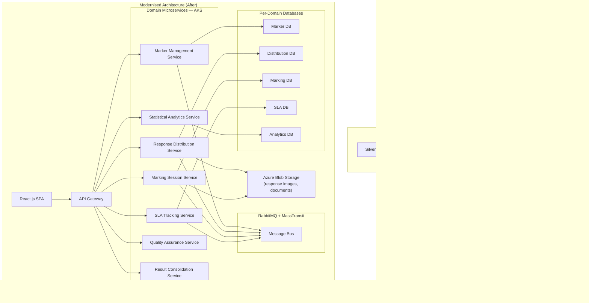
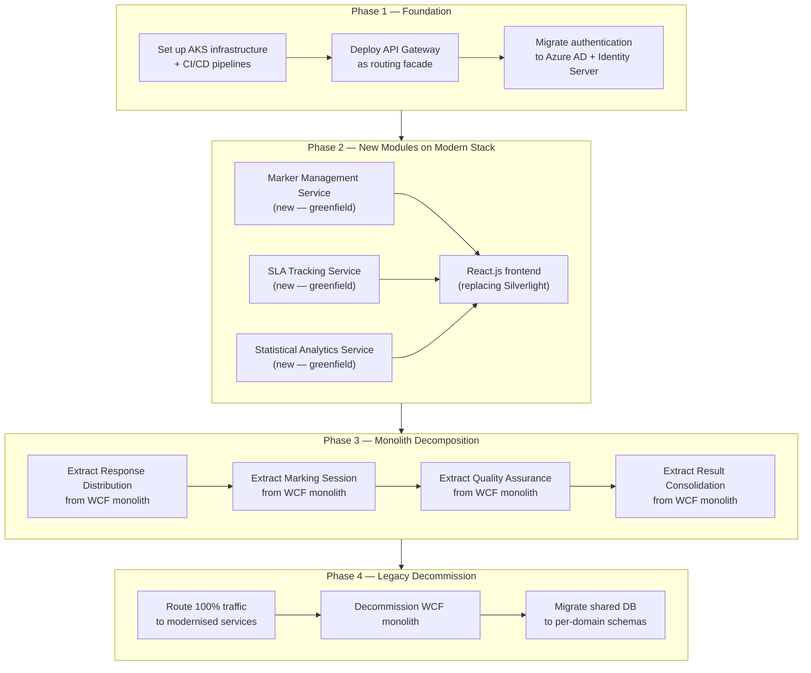
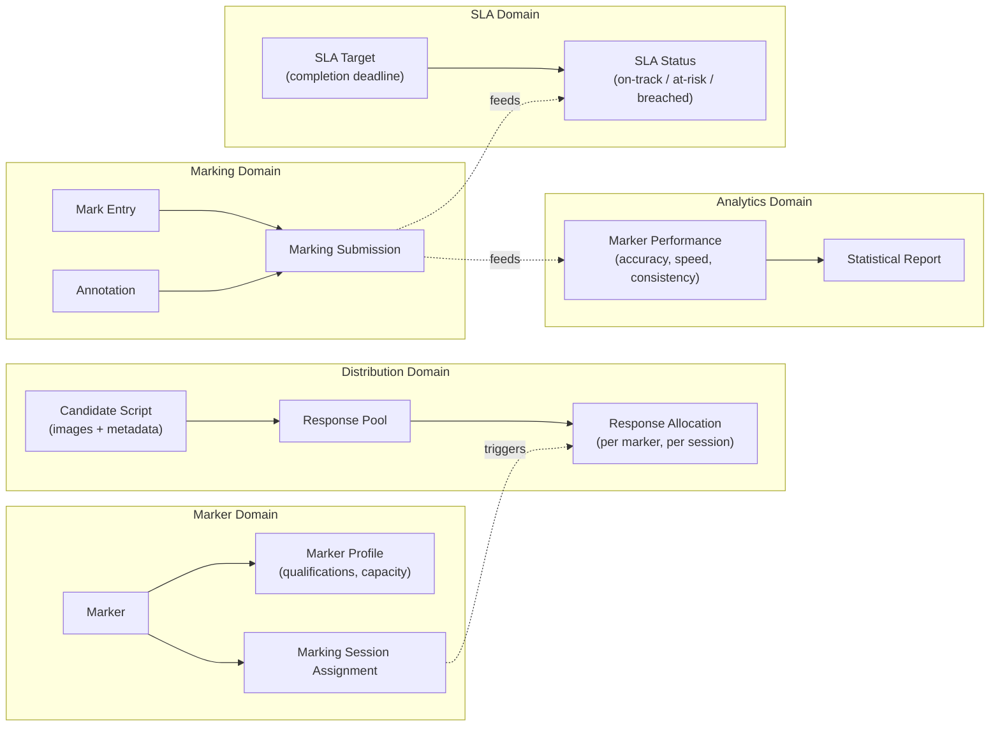
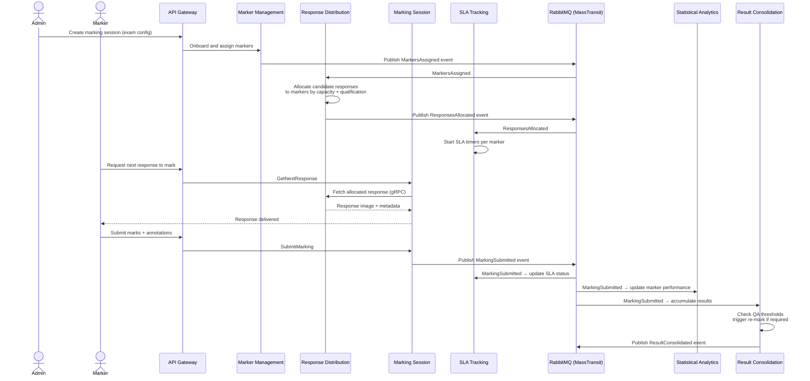
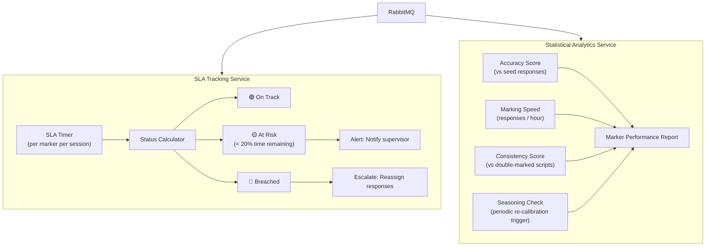
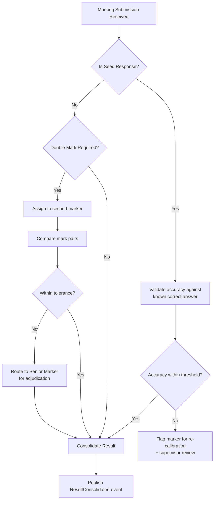
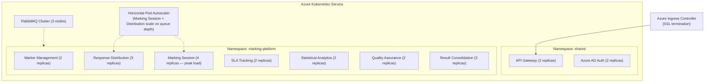

# Digital E-Marking Assessment Platform

> **Role:** Technical Lead
> **Domain:** EdTech · Digital Assessment · Platform Modernisation
> **Stack (Legacy):** .NET Framework · WCF · Silverlight · SQL Server
> **Stack (Modernised):** .NET · ASP.NET Core · C# · Microservices · RabbitMQ · MassTransit · gRPC · Docker · AKS · Azure Blob Storage · Azure Key Vault · Azure AD · React.js · Serilog · Elasticsearch · Azure Monitor · Application Insights · SQL Server

---

## Overview

Led the full modernisation of an enterprise-grade digital assessment platform from a WCF/Silverlight monolith to a cloud-native microservices architecture. The platform supports large-scale candidate response distribution, online marking, marker performance validation, result consolidation, and quality assurance across educational institutions.

The modernisation was executed incrementally — maintaining backward compatibility with legacy components during transition while delivering new capabilities on the modernised stack. New modules for marker management, response distribution, SLA tracking, and statistical analytics were architected and delivered as domain-driven microservices alongside the migration effort.

---

## Problem Context

The legacy platform was built on WCF services and a Silverlight frontend — both technologies that had reached end-of-life. The system faced several compounding challenges:

- **Silverlight deprecation** across all major browsers made the frontend inaccessible on modern clients.
- **WCF monolith** tightly coupled all business domains — marking, marker management, response distribution, and analytics — making independent scaling, deployment, and evolution impossible.
- **Single database** shared across all domains created schema coupling and made targeted performance optimisation difficult.
- **No cloud deployment** — the system ran on on-premise infrastructure with manual deployment processes, limiting scalability during peak exam periods.
- **Growing feature backlog** — new requirements for SLA-based tracking, statistical analytics, and marker performance validation could not be cleanly added to the monolith without increasing coupling further.

---

## Goals & Non-Functional Requirements

| Requirement | Detail |
|---|---|
| Browser Compatibility | Replace Silverlight frontend with a modern, browser-native React.js UI |
| Domain Decoupling | Decompose WCF monolith into independently deployable domain microservices |
| Cloud Scalability | Deploy on AKS — scale marking and distribution services independently during peak load |
| Backward Compatibility | Legacy WCF consumers remain functional during phased migration |
| New Feature Delivery | Marker management, SLA tracking, and statistical analytics delivered on modernised stack |
| Operational Visibility | Distributed tracing and structured logging across all services |
| Zero Downtime Migration | Incremental strangler fig migration — no big-bang cutover |

---

## Architecture

### Legacy vs Modernised Architecture

---

### Strangler Fig Migration Strategy

The platform was migrated incrementally using the Strangler Fig pattern. New capabilities were built on the modernised stack while legacy WCF endpoints remained active for existing consumers, with a routing facade directing traffic to old or new implementations based on feature readiness.

---

### Core Domain Model

---

### Marking Workflow — End-to-End Sequence

---

### SLA Tracking & Marker Performance

---

### Quality Assurance & Result Consolidation

---

### AKS Deployment Topology

---

## Key Technical Decisions

### Strangler Fig over Big-Bang Rewrite
A full rewrite carries high risk — the platform was business-critical during active exam periods. The Strangler Fig approach allowed new capabilities to be delivered on the modernised stack immediately while legacy WCF endpoints remained stable for existing integrations. The API Gateway acted as the routing facade, transparently directing traffic to legacy or modern implementations per domain without client-side changes.

### Database-per-Service over Shared Schema
The legacy system used a single shared SQL Server database. During decomposition, each extracted domain service was given its own database schema. This eliminated cross-domain schema coupling, allowed independent schema evolution, and enabled targeted query optimisation per domain access pattern. Data consistency across domains is maintained via eventual consistency through domain events on RabbitMQ rather than distributed transactions.

### gRPC for Response Delivery in Marking Workflow
Marker clients require low-latency delivery of response images and metadata when requesting the next script to mark. This path is synchronous and latency-sensitive — RabbitMQ async messaging is not appropriate here. gRPC with protobuf serialisation was used for response delivery between the Marking Session Service and the Response Distribution Service, providing strongly-typed contracts and reduced payload size versus REST/JSON.

### RabbitMQ + MassTransit for Cross-Domain Event Propagation
Domain events — marking submissions, SLA updates, performance metrics — need to propagate to multiple consuming services (SLA Tracking, Analytics, Result Consolidation) without tight coupling. RabbitMQ fanout exchanges with MassTransit consumers allow multiple domains to react to the same event independently, each maintaining its own state without the producer knowing its consumers.

### React.js for Silverlight Replacement
Silverlight was no longer supported in any major browser, making the legacy frontend completely inaccessible on modern clients. React.js was selected for its component model, ecosystem maturity, and compatibility with the team's existing JavaScript skills. The new frontend was built incrementally alongside the Silverlight frontend — feature parity was achieved module by module before cutover.

---

## Challenges & Solutions

| Challenge | Solution |
|---|---|
| Maintaining backward compatibility during WCF decomposition | API Gateway routing facade — legacy WCF routes preserved until each domain was fully migrated; no breaking changes to existing integrations |
| Shared database — cross-domain queries used throughout monolith | Identified and catalogued all cross-domain queries; replaced with domain event-driven eventual consistency or dedicated read models per consuming service |
| Silverlight UI tightly coupled to WCF data contracts | Defined new REST/JSON API contracts independently of WCF; Silverlight and React ran in parallel with feature flags controlling which frontend was served per user group |
| Peak exam load overwhelming marking session service | Marking Session and Response Distribution pods scaled independently via HPA; queue-based load levelling via RabbitMQ prevented direct traffic spikes reaching services |
| Marker performance analytics requiring cross-domain data | Statistical Analytics Service subscribes to events from Marking, Distribution, and QA domains, building its own read-optimised data model — no cross-service queries |
| Legacy WCF data contracts incompatible with new domain models | Anti-Corruption Layer introduced at domain boundaries during extraction — translated legacy data contracts to new domain model without polluting the modern service internals |

---

## Outcomes

| Area | Result |
|---|---|
| Browser Compatibility | React.js frontend fully operational on all modern browsers — Silverlight dependency eliminated |
| Domain Decoupling | WCF monolith decomposed into independently deployable domain services |
| Scalability | Marking Session and Distribution services scale independently during peak exam load |
| Feature Delivery | Marker management, SLA tracking, and statistical analytics delivered on modernised stack |
| Migration Safety | Zero downtime — Strangler Fig migration with no big-bang cutover |
| Operational Visibility | End-to-end distributed tracing across all services via Application Insights + Elasticsearch |

---

## Patterns Applied

| Pattern | Application |
|---|---|
| **Strangler Fig** | Incremental WCF monolith decomposition via API Gateway routing facade |
| **Database-per-Service** | Each domain service owns its schema — no shared database |
| **Anti-Corruption Layer** | Translates legacy WCF data contracts to new domain models at extraction boundaries |
| **Event-Driven Architecture** | Cross-domain state propagation via RabbitMQ domain events — no cross-service queries |
| **CQRS** | Read models built per-domain from events (Analytics, SLA) — separate from write models |
| **Saga (Choreography)** | Marking workflow coordinated via domain events across Marking, SLA, Analytics, and Result services |
| **Domain-Driven Design** | Service boundaries aligned to bounded contexts — Marker, Distribution, Marking, SLA, Analytics, QA, Results |
| **API Gateway (Routing Facade)** | Transparent routing between legacy WCF and modernised services during migration |