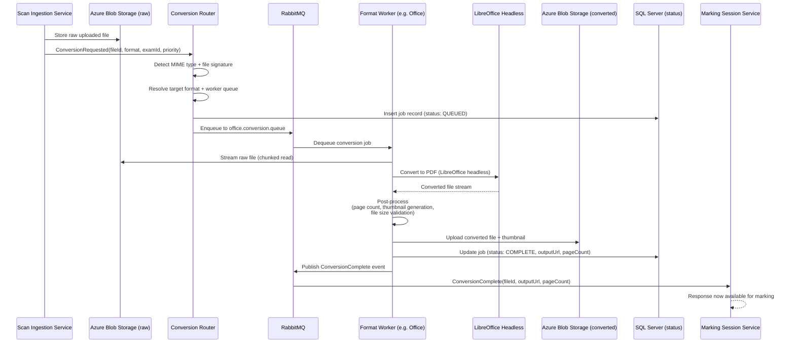
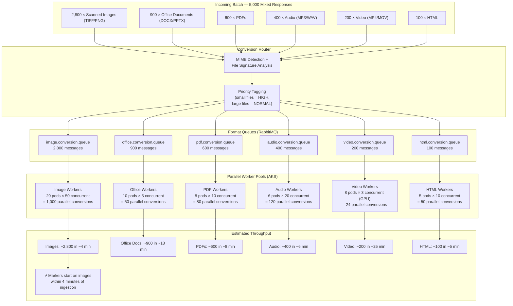
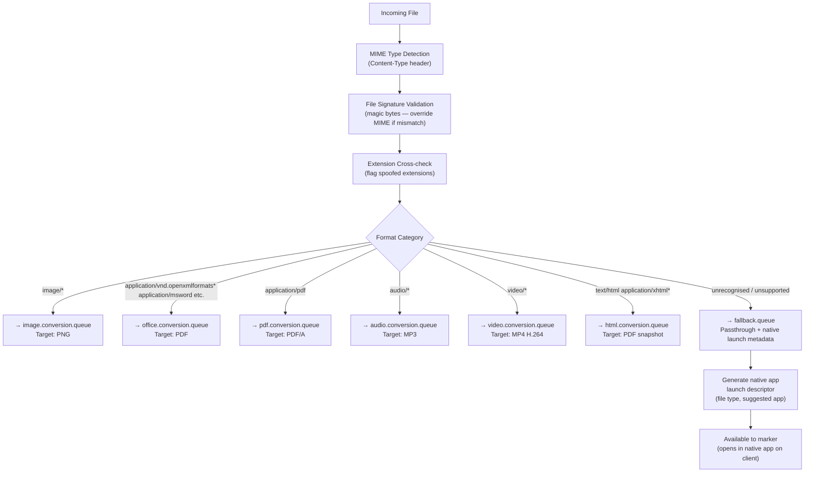
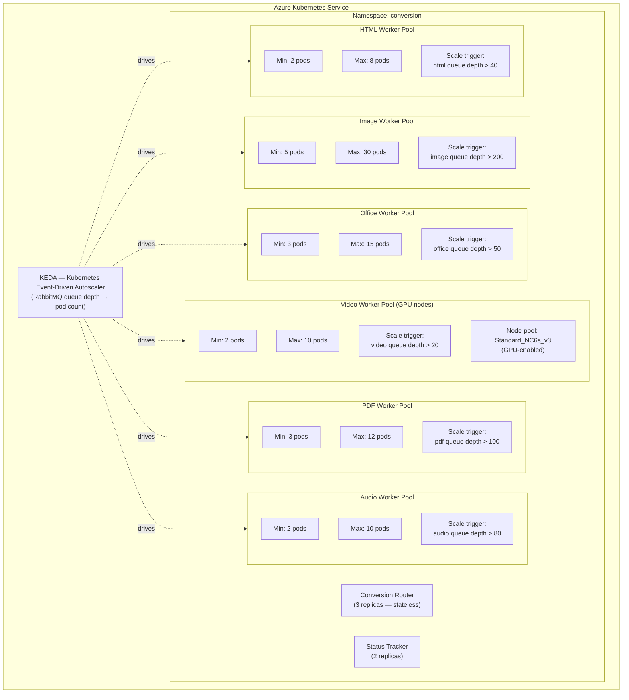
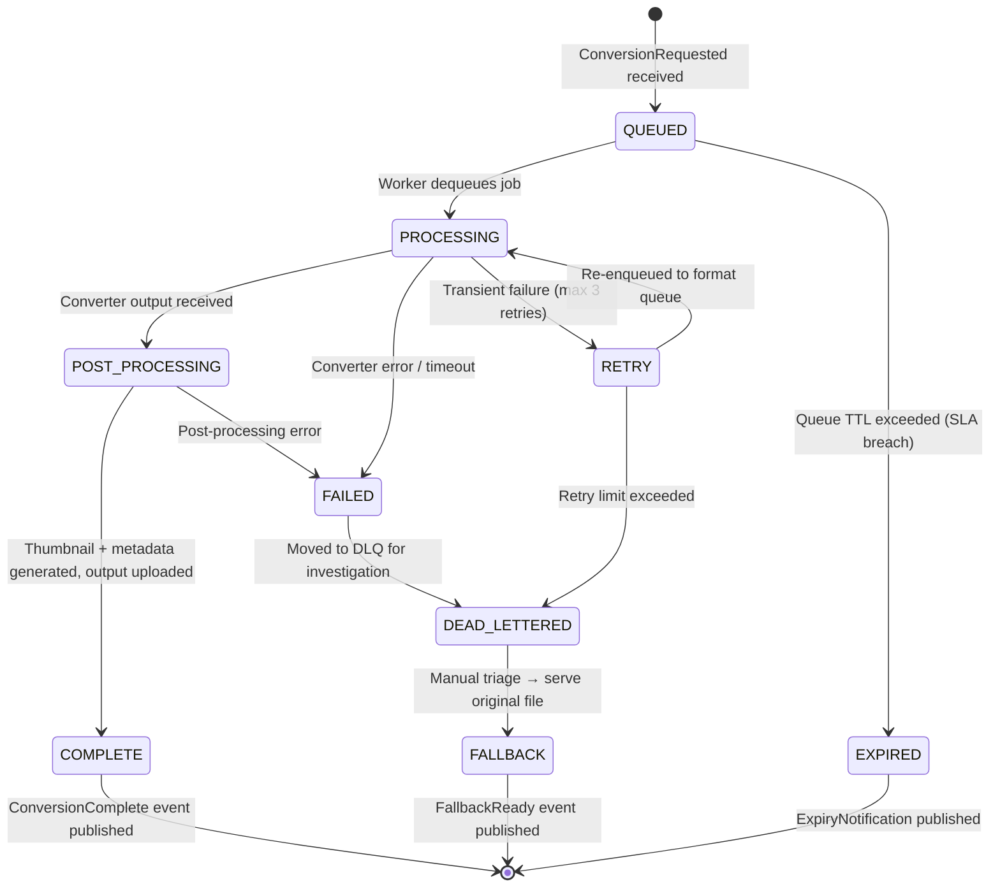
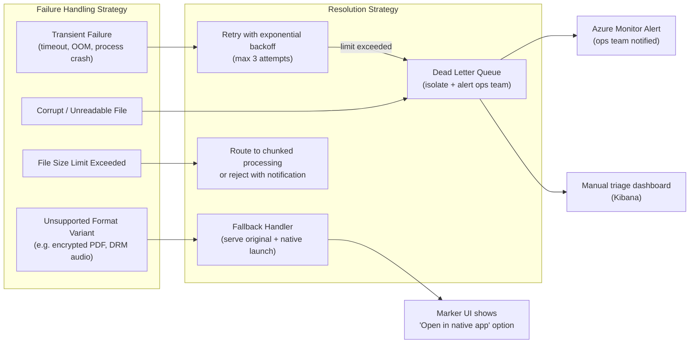
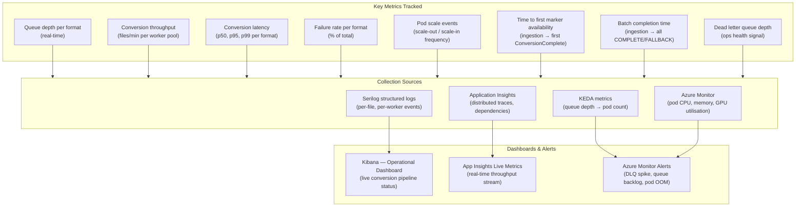

# Document Conversion Service — Digital E-Marking Platform

> **Role:** Technical Lead (Architect)
> **Domain:** EdTech · Digital Assessment · Multimedia Processing · High-Throughput File Conversion
> **Parent System:** Digital E-Marking Assessment Platform
> **Stack:** .NET · ASP.NET Core · C# · Microservices · RabbitMQ · MassTransit · Docker · AKS · Azure Blob Storage · Azure Key Vault · FFmpeg · LibreOffice Headless · Ghostscript · Chromium Headless · ImageMagick · gRPC · Serilog · Elasticsearch · Azure Monitor · Application Insights · SQL Server

---

## Overview

The Document Conversion Service is a high-throughput, horizontally scalable conversion engine that sits at the critical path of the digital marking workflow. The e-marking platform supports candidate responses in a wide range of formats — scanned images, audio recordings, video submissions, Office documents, PDFs, HTML files, and other multimedia — all of which must be converted to platform-supported portable formats before markers can begin their work.

Conversion is a hard prerequisite for marking. Until a response is converted and available in the marking platform, markers cannot start. At scale — thousands of candidate responses across multiple simultaneous exam sessions — a slow or bottlenecked conversion pipeline directly delays the start of marking, with downstream impact on SLA compliance, marker availability windows, and exam result timelines.

The architecture was specifically designed to eliminate this bottleneck through parallel processing, horizontal pod scaling, format-specific converter routing, and a non-blocking pipeline that decouples conversion throughput from marking platform availability.

---

## Problem Context

Before the conversion service was re-architected, the system processed files sequentially in a single processing loop. As exam volumes grew and response format diversity increased, this became the primary bottleneck in the entire marking pipeline:

- **Sequential processing** meant a batch of 5,000 responses queued behind each other — large video or PDF files blocked all subsequent items regardless of their size or complexity.
- **No format-specific routing** — every file went through the same processing path regardless of whether it was a 10KB image or a 500MB video file.
- **Single instance deployment** meant no horizontal scale — a single pod processed the entire conversion queue for an exam session.
- **Synchronous conversion calls** from the marking platform blocked marker-facing APIs while waiting for conversion results.
- **No partial availability** — markers could not begin on completed conversions while the remainder of the batch was still processing.
- **Failures were silent** — a corrupt or unsupported file caused the processing loop to stall; downstream markers had no visibility into conversion status.

The combined effect: **marking start was delayed by hours** on large exam runs, compressing marker availability windows and creating SLA risk.

---

## Goals & Non-Functional Requirements

| Requirement | Detail |
|---|---|
| **Throughput** | Process 10,000+ mixed-format responses per exam session within the ingestion window |
| **Parallelism** | Concurrent conversion across format types — large files must not block small files |
| **Partial Availability** | Converted responses available to markers immediately, before the full batch completes |
| **Format Coverage** | Images, audio, video, Office documents (Word/Excel/PowerPoint), PDF, HTML, and other file types |
| **Horizontal Scalability** | Per-format worker pools scale independently based on queue depth |
| **Resilience** | Conversion failures isolated per file — no single failure stalls the batch |
| **Fallback Handling** | Unconvertible files delivered to markers with native application launch capability |
| **Observability** | Per-file conversion status, queue depth, throughput metrics, and failure rates visible in real time |
| **Non-Blocking Integration** | Conversion pipeline fully async — marking platform APIs never block on conversion |

---

## Supported Format Matrix

| Input Category | Input Formats | Conversion Target | Converter |
|---|---|---|---|
| Scanned Images | TIFF, BMP, JPEG, PNG, HEIC | PNG (normalised, deskewed) | ImageMagick |
| Office Documents | DOCX, XLSX, PPTX, DOC, XLS, PPT | PDF | LibreOffice Headless |
| PDF | PDF (any version) | PDF/A (normalised, page-split) | Ghostscript |
| Audio | MP3, WAV, M4A, AAC, OGG, FLAC | MP3 (normalised bitrate) | FFmpeg |
| Video | MP4, MOV, AVI, MKV, WMV, WebM | MP4 (H.264, web-optimised) | FFmpeg |
| HTML / Web | HTML, HTM, MHTML | PDF (rendered snapshot) | Chromium Headless |
| Rich Text | RTF, ODT, ODS, ODP | PDF | LibreOffice Headless |
| Fallback (unconvertible) | Any unrecognised format | Original file preserved + native launch metadata | — |

---

## Architecture

### High-Level System Architecture

```mermaid
graph TB
    subgraph Upstream["Upstream — Scan Ingestion"]
        IngestionSvc["Scan Ingestion Service"]
        BlobIn["Azure Blob Storage<br/>(raw uploaded files)"]
    end

    subgraph ConversionPlatform["Document Conversion Service — AKS"]
        Router["Conversion Router<br/>(format detection + queue dispatch)"]

        subgraph WorkerPools["Format-Specific Worker Pools"]
            ImageWorker["Image Workers<br/>(ImageMagick)"]
            OfficeWorker["Office Workers<br/>(LibreOffice Headless)"]
            PDFWorker["PDF Workers<br/>(Ghostscript)"]
            AudioWorker["Audio Workers<br/>(FFmpeg)"]
            VideoWorker["Video Workers<br/>(FFmpeg — GPU nodes)"]
            HTMLWorker["HTML Workers<br/>(Chromium Headless)"]
            FallbackWorker["Fallback Handler<br/>(passthrough + metadata)"]
        end

        StatusTracker["Conversion Status Tracker"]
        ResultPublisher["Result Publisher"]
    end

    subgraph Messaging["RabbitMQ — MassTransit"]
        ImageQ["image.conversion.queue"]
        OfficeQ["office.conversion.queue"]
        PDFQ["pdf.conversion.queue"]
        AudioQ["audio.conversion.queue"]
        VideoQ["video.conversion.queue"]
        HTMLQ["html.conversion.queue"]
        FallbackQ["fallback.queue"]
        DLQ["Dead Letter Queue"]
        ResultQ["conversion.result.queue"]
    end

    subgraph Downstream["Downstream — Marking Platform"]
        MarkingSvc["Marking Session Service"]
        DistSvc["Response Distribution Service"]
        NotifySvc["Notification Service"]
    end

    subgraph Storage["Storage"]
        BlobOut["Azure Blob Storage<br/>(converted output files)"]
        DB["SQL Server<br/>(conversion job metadata, status)"]
    end

    subgraph Observability["Observability"]
        AppInsights["Application Insights"]
        Elastic["Elasticsearch + Kibana"]
        Monitor["Azure Monitor<br/>(HPA metrics, queue depth alerts)"]
    end

    IngestionSvc --> BlobIn
    IngestionSvc -->|ConversionRequested event| Router

    Router --> ImageQ & OfficeQ & PDFQ & AudioQ & VideoQ & HTMLQ & FallbackQ

    ImageQ --> ImageWorker
    OfficeQ --> OfficeWorker
    PDFQ --> PDFWorker
    AudioQ --> AudioWorker
    VideoQ --> VideoWorker
    HTMLQ --> HTMLWorker
    FallbackQ --> FallbackWorker

    ImageWorker & OfficeWorker & PDFWorker & AudioWorker & VideoWorker & HTMLWorker & FallbackWorker --> BlobOut
    ImageWorker & OfficeWorker & PDFWorker & AudioWorker & VideoWorker & HTMLWorker --> StatusTracker
    StatusTracker --> DB
    StatusTracker --> ResultPublisher
    ResultPublisher --> ResultQ

    ResultQ --> MarkingSvc
    ResultQ --> DistSvc
    ResultQ --> NotifySvc

    ImageWorker -->|on failure| DLQ
    OfficeWorker -->|on failure| DLQ
    VideoWorker -->|on failure| DLQ

    StatusTracker --> AppInsights
    Router --> Elastic
    Monitor --> VideoWorker
    Monitor --> OfficeWorker
```

---

### Conversion Request Lifecycle

---

### Parallel Processing Architecture

The core architectural fix for the bottleneck was separating format-specific queues with independent worker pools. Heavy formats (video, large Office files) no longer block lightweight formats (images, audio). Each pool scales independently.

---

### Format Detection & Routing Logic

---

### Horizontal Scaling — AKS + HPA Configuration

> **Note:** Standard Kubernetes HPA scales on CPU/memory. KEDA extends this to scale directly on RabbitMQ queue depth — a more accurate signal for conversion workload than CPU utilisation alone.

---

### Conversion Status State Machine

---

### Resilience & Failure Handling

---

### Observability & Performance Metrics

---

## Key Technical Decisions

### Separate Queues per Format Type
The root cause of the original bottleneck was a single processing queue where a 500MB video file blocked thousands of 50KB images behind it. Splitting into format-specific queues with independent worker pools meant each format type progressed at its natural throughput rate. Image conversion — the most common format — was fully parallelised and completed within minutes of ingestion, giving markers early access to the bulk of responses while heavier formats continued processing in parallel.

### KEDA for Queue-Depth-Driven Autoscaling
Standard Kubernetes HPA scales on CPU and memory utilisation. For conversion workloads, CPU is a lagging indicator — a queue of 2,000 pending jobs may not immediately spike CPU on a small pod pool. KEDA (Kubernetes Event-Driven Autoscaler) integrates directly with RabbitMQ queue depth as the scaling metric, triggering pod scale-out the moment a queue backlog appears rather than waiting for CPU saturation. This dramatically reduced time-to-scale during burst ingestion.

### GPU Node Pool for Video Conversion
FFmpeg video conversion is computationally intensive. Running video conversion on standard CPU nodes required 8–12 minutes per file on large MP4 submissions. Dedicated GPU node pools (Azure NC-series) with hardware-accelerated FFmpeg (`h264_nvenc`) reduced per-file video conversion time significantly. GPU nodes are kept at minimum replica count and scale only when the video queue depth exceeds threshold, controlling cost.

### File Signature Validation over MIME Trust
Candidates submitting responses could upload files with incorrect or spoofed extensions and MIME types. Routing based on Content-Type header alone caused converter failures when a file declared as `application/pdf` was actually a renamed DOCX. The Router performs magic byte (file signature) analysis as the authoritative format signal, cross-referencing against the declared MIME type and extension. Mismatches are flagged and routed to the correct worker — not silently failed.

### Chunked Streaming for Large File I/O
Loading large files (video, high-resolution TIFF scans) entirely into memory before conversion caused OOM kills on worker pods. All file reads and writes were refactored to use chunked streaming — workers stream from Azure Blob Storage directly into the converter process stdin and stream output back to Blob without materialising the full file in pod memory. This stabilised memory usage and eliminated OOM-related conversion failures on large files.

### Partial Availability — Notify on Each Completion
Rather than waiting for the entire batch to complete before notifying the marking platform, the Result Publisher fires a `ConversionComplete` event per file the moment it is ready. The Marking Session Service registers each individual completion and makes that response immediately available to markers. This eliminated the "all or nothing" availability model and allowed marking to begin on the first converted responses within minutes of batch ingestion.

---

## Challenges & Solutions

| Challenge | Solution |
|---|---|
| Large video/Office files blocking image conversions | Format-specific queues with independent worker pools — formats never share a queue |
| CPU-based HPA lagging behind burst ingestion | KEDA RabbitMQ queue depth trigger — pods scale out at queue depth threshold, not CPU saturation |
| OOM pod crashes on large file processing | Chunked streaming I/O — files streamed from Blob through converter to output without full in-memory materialisation |
| Spoofed file extensions causing converter failures | Magic byte (file signature) detection overrides declared MIME type — correct worker always receives the file |
| Encrypted PDFs and DRM-protected audio unreadable by converters | Detected at routing stage; routed to fallback handler — marker receives original file with native launch option |
| Chromium Headless memory leaks in HTML worker pods | Pod-level lifecycle limits — each Chromium worker pod recycles after N conversions; prevents gradual memory exhaustion |
| LibreOffice Headless process stability on concurrent workloads | Each Office worker spawns isolated LibreOffice processes per job (not shared); process exit after each conversion prevents state corruption |
| Marking delayed until full batch complete | Per-file `ConversionComplete` events — marking platform notified and response unlocked individually as each file completes |
| No visibility into pipeline health during exam runs | Kibana operational dashboard with real-time queue depth, throughput, and failure rate per format; Azure Monitor alerts on DLQ spikes |

---

## Performance Improvements

| Metric | Before (Sequential) | After (Parallel + HPA) | Improvement |
|---|---|---|---|
| Time to first marker availability (5,000 file batch) | ~45 minutes | ~4 minutes | **~91% reduction** |
| Full batch completion time (5,000 mixed files) | ~3.5 hours | ~28 minutes | **~87% reduction** |
| Image conversion throughput | ~120 files/min (single pod) | ~1,400 files/min (20 pods) | **~12× increase** |
| Office document conversion throughput | ~8 files/min | ~45 files/min | **~5.6× increase** |
| Video conversion time (avg 200MB file) | ~11 minutes (CPU) | ~2.5 minutes (GPU) | **~77% reduction** |
| Conversion failure rate (OOM / process crash) | ~4.2% of files | ~0.3% of files | **~93% reduction** |
| Pod OOM kill incidents per exam run | ~12–18 | 0–1 | **Effectively eliminated** |
| Marking session start delay (SLA impact) | Frequent (hours late) | None — markers start on first converted responses | **SLA breaches eliminated** |

---

## Outcomes

| Area | Result |
|---|---|
| Bottleneck Elimination | Conversion pipeline no longer on the critical path of marking start |
| Partial Availability | Markers start within minutes of ingestion on the first completed format group |
| Format Coverage | All platform-supported formats handled; unconvertible files gracefully fall back to native launch |
| Resilience | Individual file failures isolated — no single failure stalls the batch |
| Scalability | Worker pools scale independently per format; GPU nodes provisioned only when needed |
| Operational Visibility | Real-time pipeline health dashboards with per-format throughput and failure metrics |

---

## Patterns Applied

| Pattern | Application |
|---|---|
| **Competing Consumers** | Multiple worker pods consume from the same format queue concurrently |
| **Priority Queue** | Small files tagged HIGH priority — processed before large files within the same format queue |
| **Dead Letter Channel** | Failed conversions routed to DLQ — isolated without stalling the batch |
| **Claim Check** | Large files stored in Azure Blob; only the reference (fileId, blobUrl) passes through the message bus |
| **Pipes and Filters** | Conversion pipeline composed of discrete stages: detect → route → convert → post-process → publish |
| **Event-Driven Architecture** | Per-file `ConversionComplete` events drive partial availability in the marking platform |
| **Sidecar Pattern** | Format-specific converter tooling (LibreOffice, FFmpeg, Chromium) isolated per worker pod type |
| **Bulkhead** | Format-specific worker pools isolate failures and resource contention between format types |