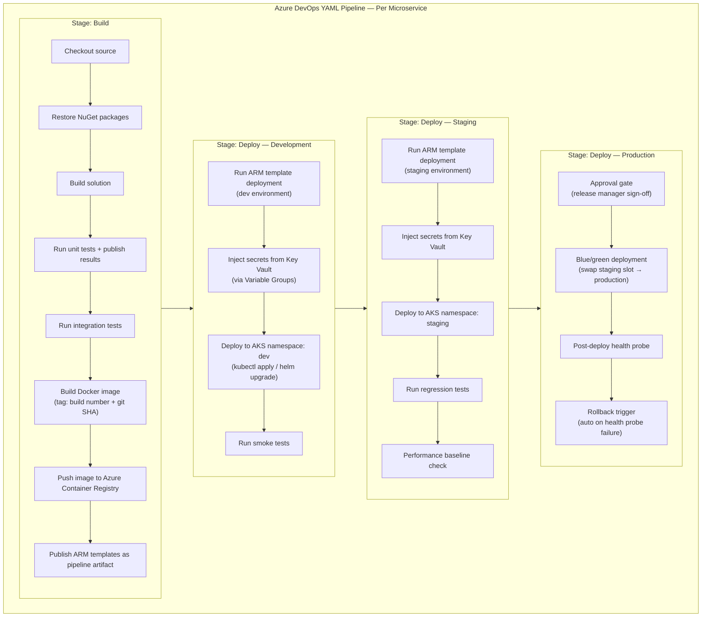
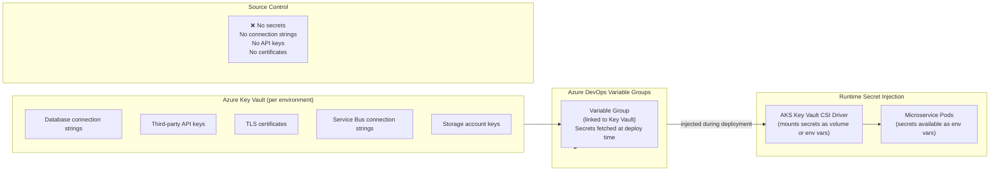
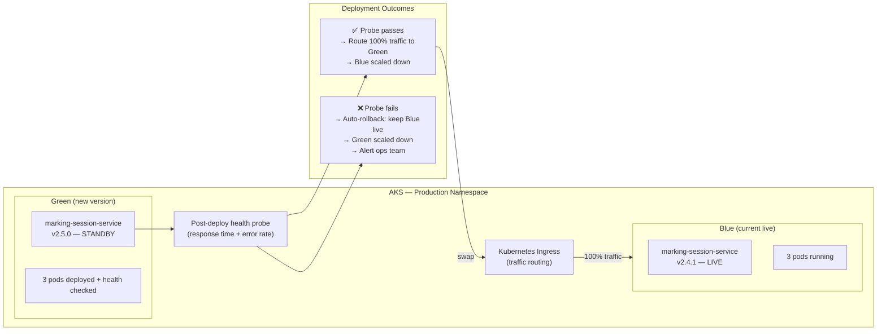
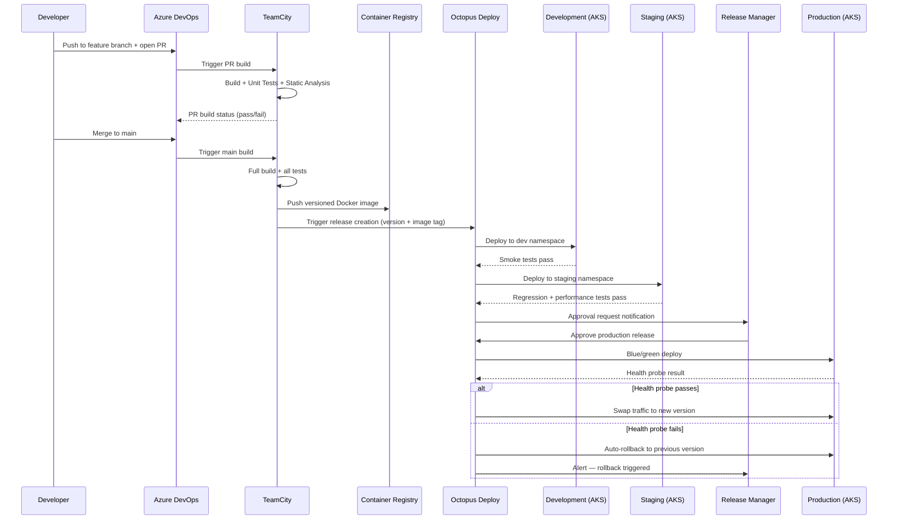
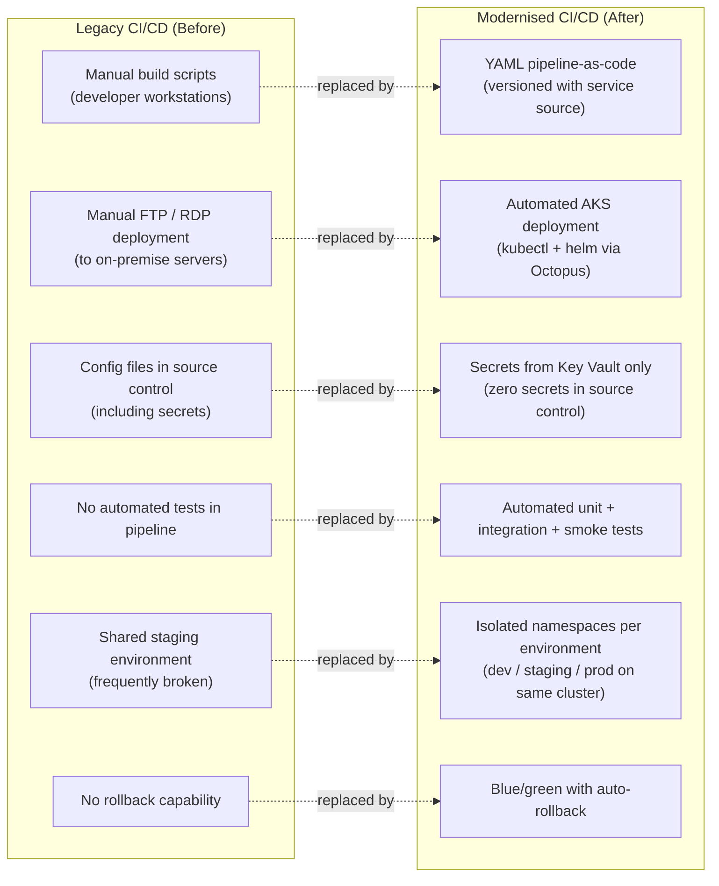

# Digital E-Marking Platform — Cloud Migration & DevOps Transformation

> **Role:** Technical Lead
> **Domain:** DevOps · Cloud Infrastructure · CI/CD · Infrastructure as Code
> **Parent System:** Digital E-Marking Assessment Platform
> **Stack:** Azure DevOps Pipelines · TeamCity · Octopus Deploy · ARM Templates · Microsoft Azure · AKS · Azure Blob Storage · Azure Key Vault · Docker · Kubernetes · PowerShell · CI/CD Automation · Infrastructure as Code (IaC)

---

## Overview

Led the DevOps transformation initiative aligned with the modernisation of the Digital E-Marking Platform. Designed and implemented end-to-end CI/CD pipelines, Infrastructure as Code (IaC), and automated Azure deployments to enable scalable, repeatable, and production-ready cloud delivery across all platform microservices.

The initiative eliminated manual deployment processes that were causing inconsistent environment states, extended release cycles, and production incidents from configuration drift. It standardised environment provisioning from development through to production, introduced automated build, test, and release workflows, and established the deployment foundation on which the modernised microservices architecture was delivered.

---

## Problem Context

Prior to the transformation, the platform's release and infrastructure processes were largely manual and undocumented:

- **Manual deployments** performed by developers directly on servers — no repeatable, auditable process.
- **Environment drift** between development, staging, and production caused bugs that only appeared in production.
- **No infrastructure as code** — environments were provisioned by hand; recreating a lost environment was a multi-day effort.
- **Long release cycles** — a release required coordinating multiple developers to manually deploy services in dependency order, taking hours per environment.
- **No automated testing gates** — code merged to main without automated build validation or test execution.
- **Secret management** handled via config files checked into source control or shared over messaging channels.
- **No rollback mechanism** — failed deployments required manual file replacement and service restarts.
- **Monolithic build** — the entire application was built and deployed as a single unit, meaning a change to one service required a full-platform release.

---

## Goals & Non-Functional Requirements

| Requirement | Detail |
|---|---|
| Repeatability | Every environment provisioned from the same IaC definition — no manual steps |
| Consistency | Dev, staging, and production environments identical in configuration and topology |
| Automation | Build, test, and deploy triggered automatically on code change — no human coordination |
| Independent Service Delivery | Each microservice built, tested, and deployed independently |
| Secret Security | No secrets in source control or config files — all managed via Azure Key Vault |
| Rollback | Any release rollback achievable in under 5 minutes without manual file operations |
| Auditability | Full deployment history, approval gates, and change log per environment |
| Speed | Time from merge to production deployment under 30 minutes for a standard service change |

---

## Architecture

### CI/CD Pipeline Overview

```mermaid
graph LR
    subgraph Source["Source Control"]
        Repo["Azure DevOps Git Repo<br/>(per microservice)"]
        PR["Pull Request"]
        Main["Main Branch"]
    end

    subgraph CI["Continuous Integration — TeamCity"]
        Trigger["Build Trigger<br/>(on PR + on merge to main)"]
        Restore["NuGet Restore"]
        Build["dotnet build"]
        UnitTest["Unit Tests (xUnit)"]
        IntTest["Integration Tests"]
        CodeAnalysis["Static Code Analysis<br/>(SonarQube)"]
        DockerBuild["Docker Image Build"]
        DockerPush["Push to Azure Container Registry"]
        Artifact["Publish Build Artifact<br/>(versioned package)"]
    end

    subgraph CD["Continuous Delivery — Octopus Deploy"]
        Release["Create Release<br/>(from build artifact)"]
        DeployDev["Deploy → Development"]
        SmokeTest["Smoke Tests (automated)"]
        DeployStaging["Deploy → Staging"]
        ApprovalGate["Manual Approval Gate<br/>(release manager)"]
        DeployProd["Deploy → Production"]
        PostDeploy["Post-Deploy Health Check"]
    end

    PR --> Trigger
    Main --> Trigger
    Trigger --> Restore --> Build --> UnitTest --> IntTest --> CodeAnalysis --> DockerBuild --> DockerPush --> Artifact
    Artifact --> Release
    Release --> DeployDev --> SmokeTest --> DeployStaging --> ApprovalGate --> DeployProd --> PostDeploy
```

---

### Azure DevOps Pipeline — Modernised Pipeline Architecture

As the platform migrated to Azure DevOps, pipelines were redefined as YAML-based pipeline-as-code, stored alongside the service source code and version-controlled.

---

### Infrastructure as Code — ARM Template Structure

```mermaid
graph TD
    subgraph IaC["ARM Template Hierarchy"]
        Master["master-deploy.json<br/>(orchestration template)"]

        subgraph Networking["Networking"]
            VNet["vnet.json<br/>(Virtual Network + subnets)"]
            NSG["nsg.json<br/>(Network Security Groups)"]
        end

        subgraph Compute["Compute"]
            AKS_Template["aks-cluster.json<br/>(AKS cluster + node pools)"]
            ACR["acr.json<br/>(Azure Container Registry)"]
        end

        subgraph Storage["Storage & Data"]
            SQL["sql-server.json<br/>(Azure SQL Server + databases)"]
            Blob["storage-account.json<br/>(Blob Storage + containers)"]
            Cosmos["cosmosdb.json<br/>(Cosmos DB account + collections)"]
        end

        subgraph Messaging["Messaging"]
            SvcBus["servicebus.json<br/>(Service Bus namespace + topics)"]
        end

        subgraph Security["Security & Config"]
            KV["keyvault.json<br/>(Key Vault + access policies)"]
            AppConfig["appconfig.json<br/>(App Configuration store)"]
        end

        subgraph Observability["Observability"]
            AppInsights_T["appinsights.json<br/>(Application Insights)"]
            LogAnalytics["loganalytics.json<br/>(Log Analytics workspace)"]
        end

        Master --> VNet --> NSG
        Master --> AKS_Template & ACR
        Master --> SQL & Blob & Cosmos
        Master --> SvcBus
        Master --> KV & AppConfig
        Master --> AppInsights_T & LogAnalytics
    end

    subgraph Params["Environment Parameter Files"]
        DevParams["dev.parameters.json"]
        StagingParams["staging.parameters.json"]
        ProdParams["prod.parameters.json"]
    end

    Master --> DevParams & StagingParams & ProdParams
```

---

### Secret Management Architecture

---

### Blue/Green Deployment Strategy

---

### Environment Topology

```mermaid
graph TB
    subgraph Dev["Development Environment"]
        DevAKS["AKS — dev namespace<br/>(1 replica per service)"]
        DevSQL["Azure SQL — dev tier<br/>(Basic SKU)"]
        DevBlob["Azure Blob Storage<br/>(dev container)"]
        DevKV["Key Vault — dev"]
    end

    subgraph Staging["Staging Environment"]
        StgAKS["AKS — staging namespace<br/>(2 replicas per service)"]
        StgSQL["Azure SQL — staging tier<br/>(Standard SKU — prod-like)"]
        StgBlob["Azure Blob Storage<br/>(staging container)"]
        StgKV["Key Vault — staging"]
    end

    subgraph Prod["Production Environment"]
        ProdAKS["AKS — production namespace<br/>(3+ replicas — HPA enabled)"]
        ProdSQL["Azure SQL — production tier<br/>(Business Critical SKU)"]
        ProdBlob["Azure Blob Storage<br/>(prod — geo-redundant)"]
        ProdKV["Key Vault — production<br/>(soft-delete + purge protection)"]
    end

    subgraph Shared["Shared — All Environments"]
        ACR["Azure Container Registry<br/>(image repository)"]
        ADO["Azure DevOps<br/>(pipelines, variable groups, artifact feeds)"]
    end

    ADO -->|deploy| Dev & Staging & Prod
    ACR -->|pull images| DevAKS & StgAKS & ProdAKS
```

---

### Pipeline Execution Flow — From Commit to Production

---

### Migration from Legacy CI/CD to Azure DevOps

---

## Key Technical Decisions

### Pipeline-as-Code (YAML) in Azure DevOps
Pipeline definitions stored as YAML files alongside service source code. This ensures pipeline changes are version-controlled, peer-reviewed via pull requests, and automatically applied — eliminating the risk of pipeline drift between environments. Each microservice owns its pipeline definition, enabling independent evolution without central pipeline configuration bottlenecks.

### TeamCity + Octopus Deploy for Build/Release Separation
The CI and CD concerns were deliberately separated. TeamCity owns the build, test, and image production phase — outputs a versioned, immutable artifact. Octopus Deploy owns the release orchestration — manages environment-specific deployment configuration, approval gates, and rollback. This separation allows the same immutable artifact to be promoted through environments without rebuilding, ensuring what was tested in staging is exactly what reaches production.

### ARM Templates over Portal-Based Provisioning
All Azure infrastructure defined as ARM JSON templates with environment-specific parameter files. Every environment — development, staging, production — is provisioned from the same templates with different parameters. This eliminated environment drift, made infrastructure changes reviewable in pull requests, and reduced environment recovery time from days to under 30 minutes.

### Blue/Green Deployment with Automated Health-Probe Rollback
Given the platform's exam-critical nature, failed production deployments required an immediate recovery mechanism that did not depend on human intervention. Blue/green deployment keeps the previous version live until the new version passes automated health probes. On probe failure, traffic remains on the previous version automatically — rollback completes in under 60 seconds with no manual steps required.

### KEDA-Compatible HPA Configuration in IaC
AKS node pool and HPA configurations were included in the ARM templates, ensuring that autoscaling behaviour for conversion and marking services was consistently provisioned across environments. KEDA operator installation was also scripted as a post-provisioning step, making the entire scaling infrastructure reproducible from IaC.

---

## Challenges & Solutions

| Challenge | Solution |
|---|---|
| Secrets in source control across legacy services | Audit of all repositories to identify and remove secrets; migrated all credentials to Azure Key Vault with pipeline Variable Groups; enforced via branch policy pre-commit scanning |
| Legacy monolith built as single deployable unit | Decomposed into per-service pipelines during modernisation; each service versioned and deployed independently from the point of extraction from the monolith |
| Inconsistent environment states causing staging-to-production bugs | ARM templates with per-environment parameter files enforced consistent topology; environment drift eliminated by prohibiting manual portal changes |
| Deployment ordering for services with inter-dependencies | Octopus Deploy release orchestration configured with explicit deployment ordering and dependency health checks between services |
| ARM template complexity for AKS + KEDA + Key Vault CSI | Modular nested template structure — each resource type in its own template file, orchestrated by the master template; reduces change blast radius and improves readability |
| Long production deployment windows during working hours | Blue/green deployment eliminated downtime — new version deployed in parallel, traffic swapped only after health probe passes; zero-downtime releases at any time |

---

## Outcomes

| Area | Result |
|---|---|
| Deployment Frequency | From ad-hoc manual releases (weeks apart) to multiple automated deployments per day per service |
| Time to Production | From hours of manual coordination to under 30 minutes from merge to production |
| Environment Consistency | Zero environment drift — all environments provisioned from the same ARM templates |
| Secret Security | Zero secrets in source control across all services |
| Rollback Time | From hours of manual recovery to under 60 seconds via automated blue/green rollback |
| Environment Recovery | From multi-day manual reprovisioning to under 30 minutes from ARM template execution |
| Production Incidents from Config Drift | Eliminated — consistent environment provisioning removed this category of incident |
| Release Coordination Overhead | Eliminated — independent per-service pipelines; no cross-team release synchronisation required |

---

## Patterns Applied

| Pattern | Application |
|---|---|
| **Pipeline as Code** | YAML pipeline definitions version-controlled alongside service source |
| **Immutable Artifact** | Docker image built once in CI, promoted through environments without rebuilding |
| **Blue/Green Deployment** | Zero-downtime releases with automated rollback on health probe failure |
| **Infrastructure as Code** | ARM templates with environment parameter files for consistent, repeatable provisioning |
| **Secrets Externalisation** | Azure Key Vault as the single source of truth for all credentials and secrets |
| **Environment Parity** | Dev, staging, and production provisioned from identical IaC templates |
| **Deployment Pipeline** | Build → Dev → Staging → Approval Gate → Production with automated promotion gates |
| **Shift Left Testing** | Unit and integration tests run in CI on every commit, not deferred to staging |