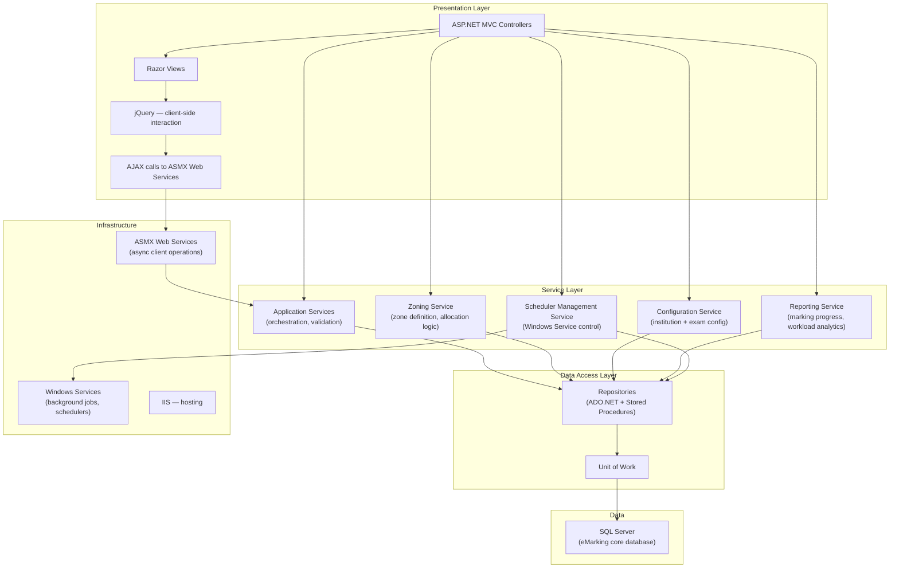
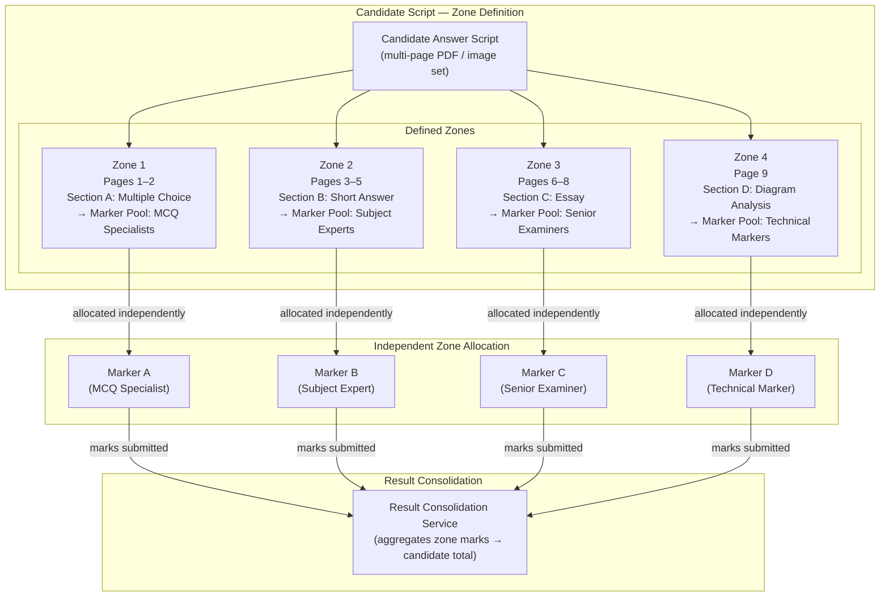
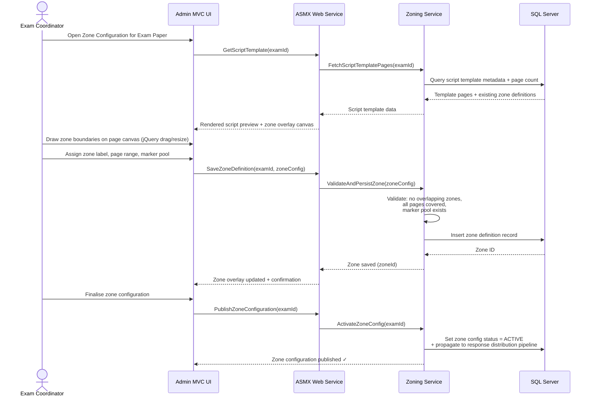
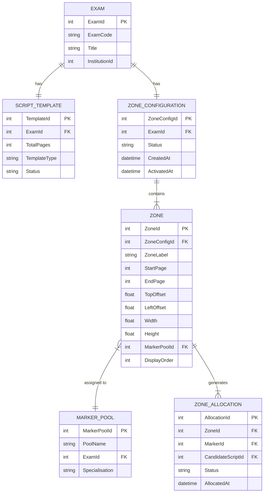
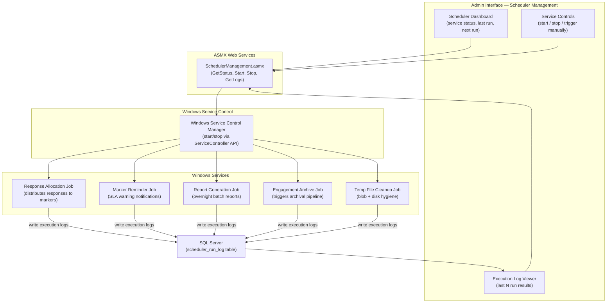
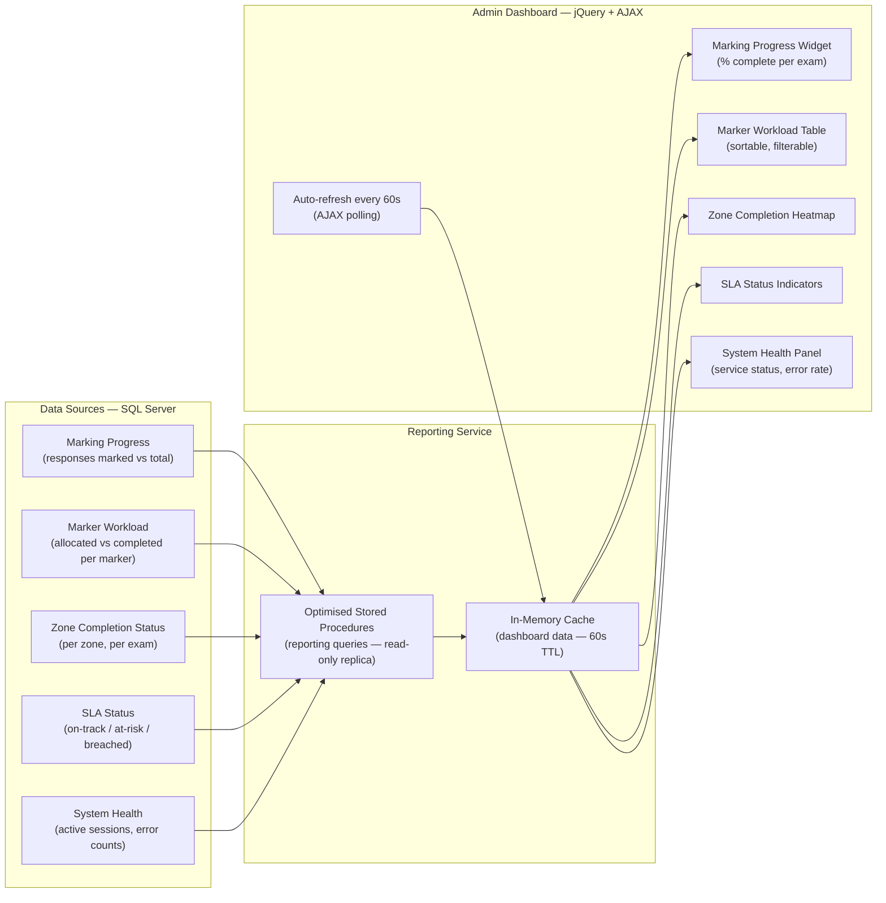
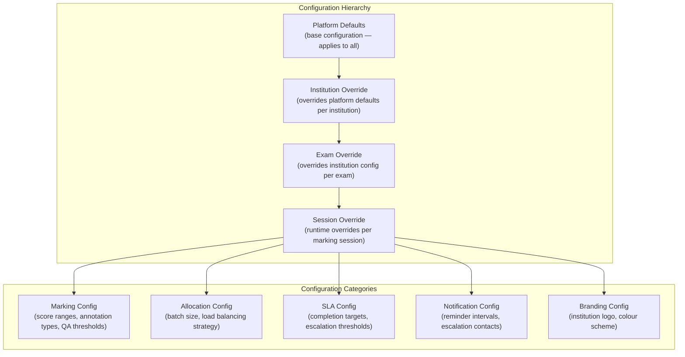

# Digital E-Marking Platform — Administration Interface

> **Role:** Technical Lead
> **Domain:** EdTech · Digital Assessment · Enterprise Administration · Workflow Configuration
> **Parent System:** Digital E-Marking Assessment Platform
> **Stack:** ASP.NET MVC · C# · .NET Framework · Layered Architecture · SQL Server · jQuery · ASMX Web Services · Windows Services · IIS

---

## Overview

Technical lead for the support, enhancement, and feature delivery phase of the Administration and Configuration interface of the Digital E-Marking Platform. The application provided centralised operational control over the entire marking ecosystem — managing system configurations, marker onboarding, master data, background service orchestration, schedulers, and operational reporting.

A key delivery during this phase was the design and implementation of the **Zoning Module** — a new capability enabling exam coordinators to split candidate answer scripts into logical zones, each independently assigned to specialist markers. This module introduced a fundamentally new way of distributing marking work and became a core feature of the platform's response allocation pipeline.

---

## Problem Context

The administration interface was a mature layered ASP.NET MVC application in active use by exam boards and university administrators. As the platform expanded its user base and marking workflows became more complex, several operational gaps emerged:

- **Monolithic script allocation** — entire candidate answer scripts were assigned to a single marker, regardless of whether different sections required different subject expertise.
- **No zone-based marking support** — multi-section papers (e.g. Part A: multiple choice, Part B: essay, Part C: diagram analysis) could not be split and assigned to specialist markers per zone.
- **Manual background service management** — Windows Services running scheduled jobs had no centralised visibility or control from the admin interface.
- **Operational reporting gaps** — administrators lacked real-time insight into marking progress, marker workloads, and system health.
- **Growing configuration complexity** — as the platform expanded to support more exam types and institutions, the administration interface needed enhancements to manage institution-specific configurations without code changes.

---

## Goals & Non-Functional Requirements

| Requirement | Detail |
|---|---|
| Zone-Based Marking | Split candidate scripts into logical answer zones; assign each zone to specialist markers independently |
| Zone Configuration UI | Interactive zone definition tool for exam coordinators — no technical knowledge required |
| Background Service Control | Centralised start/stop/status visibility for Windows Services and schedulers from the admin UI |
| Operational Reporting | Real-time dashboards for marking progress, marker workloads, SLA status, and system health |
| Configuration Management | Institution-specific and exam-specific configuration without code deployments |
| Stability | Support and enhancement phase — zero regression on existing marking workflows |
| Performance | Admin UI responsive under concurrent administrator sessions during active exam periods |

---

## Architecture

### Application Layer Architecture

---

### Zoning Module — Core Concept

The Zoning Module enables exam coordinators to define logical zones on candidate answer scripts. Each zone maps to a specific section of the paper and is independently queued for allocation to a specialist marker. A candidate's full script is marked by potentially multiple markers — one per zone — with results consolidated by the Result Consolidation Service.

---

### Zoning Module — Zone Definition UI Flow

---

### Zoning Module — Data Model

---

### Background Service Management

---

### Operational Reporting — Dashboard Architecture

---

### Configuration Management — Institution & Exam Config

---

## Key Technical Decisions

### jQuery + ASMX for Interactive Zone Canvas
The Zoning Module required an interactive page canvas — drag-to-draw zone boundaries, resize handles, page navigation, and real-time zone overlay rendering. jQuery with custom plugin wrappers was used for the canvas interaction layer, communicating with the backend via ASMX web services for zone persistence. This approach was consistent with the existing technology stack and avoided introducing a new frontend framework dependency into a mature application.

### In-Memory Cache for Reporting Queries
Operational dashboards are polled by multiple concurrent administrator sessions during active exam periods. Running reporting stored procedures on every poll request would add significant read load to the core eMarking database. A short-TTL (60-second) in-memory cache on the reporting service layer absorbs repeated dashboard polls, reducing database read pressure while keeping dashboard data near-real-time.

### Stored Procedures for Reporting Queries
Reporting queries aggregate across large marking datasets — potentially millions of marking submissions for a single exam session. Stored procedures with targeted indexing were used for all reporting queries rather than ORM-generated queries, giving full control over execution plans and enabling the DBA to optimise without application code changes. Reporting queries run against a read-optimised view layer to avoid impacting transactional write performance.

### ServiceController API for Windows Service Management
Windows Services running background jobs had no management interface — administrators had to RDP to the server to restart failed jobs. The admin UI was extended with a Scheduler Management panel using the .NET `ServiceController` API to start, stop, and query service status programmatically. Service execution logs written to a SQL table provided a queryable run history without requiring log file access.

### Zone Validation Before Activation
Zone configurations are validated before activation to prevent invalid states from propagating to the response distribution pipeline. Validation rules enforce: no overlapping zones on the same page range, full page coverage (no unmarked pages), valid marker pool assignments, and minimum zone dimensions. A zone configuration in DRAFT status can be freely edited; only on explicit activation does it propagate to the allocation pipeline.

---

## Challenges & Solutions

| Challenge | Solution |
|---|---|
| Interactive zone drawing on script page images in a server-rendered MVC app | jQuery-based canvas overlay with drag-create and resize handles; zone coordinates normalised as percentage offsets to remain resolution-independent across different script image sizes |
| Zone boundary overlaps causing marker allocation conflicts | Server-side validation on zone save checks for coordinate overlap using rectangle intersection logic; client-side visual feedback highlights conflicting zones before save |
| Reporting queries timing out during peak exam periods | Dedicated reporting stored procedures with covering indexes on high-frequency query paths; in-memory cache reduces direct DB hits; reporting queries isolated to read-only view layer |
| Windows Service failures invisible to administrators | ServiceController-based management UI with SQL-backed execution log; Azure Monitor alerts on service stop events notify ops team immediately |
| Multi-institution configuration conflicts | Hierarchical config resolution — institution and exam overrides applied at runtime using a chain-of-responsibility resolver; base platform defaults always present as fallback |
| Zone configuration changes mid-exam affecting in-progress marking | Zone config versioning — active allocations reference a pinned zone config version; changes create a new version without affecting in-progress sessions |

---

## Outcomes

| Area | Result |
|---|---|
| Zone-Based Marking | Exam coordinators can split scripts into up to 10 independent zones per paper — each allocated to specialist marker pools |
| Marking Efficiency | Multi-section papers marked concurrently by specialist pools rather than sequentially by generalist markers |
| Operational Visibility | Real-time marking progress, workload, and SLA dashboards available to all administrators without database access |
| Background Job Management | Windows Service start/stop and execution history accessible from the admin UI — no RDP access required |
| Configuration Flexibility | Institution and exam-specific configurations managed via UI — no code deployments for configuration changes |
| Stability | Enhancement and support phase delivered with zero regression on existing marking workflows |

---

## Patterns Applied

| Pattern | Application |
|---|---|
| **Layered Architecture** | Presentation → Service → Data Access → Infrastructure — clear separation of concerns |
| **Repository Pattern** | Data access abstracted behind repositories; SQL and stored procedure details hidden from service layer |
| **Unit of Work** | Transactional consistency for multi-table operations (zone definition + allocation propagation) |
| **Chain of Responsibility** | Hierarchical configuration resolution — platform → institution → exam → session |
| **Cache-Aside** | Reporting data cached in-memory with TTL; cache populated on miss, invalidated on TTL expiry |
| **Template Method** | Zone validation pipeline — base validator defines the validation sequence; format-specific rules plugged in per zone type |
| **Observer (AJAX Polling)** | Dashboard auto-refresh via AJAX polling simulates near-real-time operational awareness in a server-rendered MVC context |