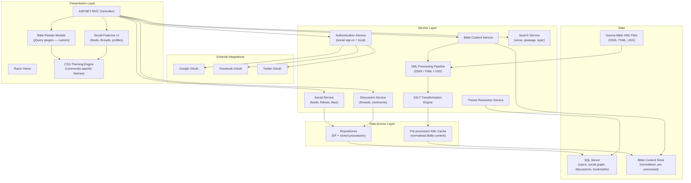
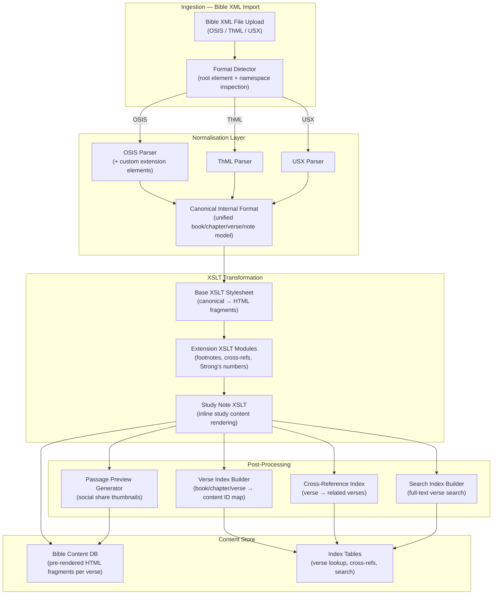
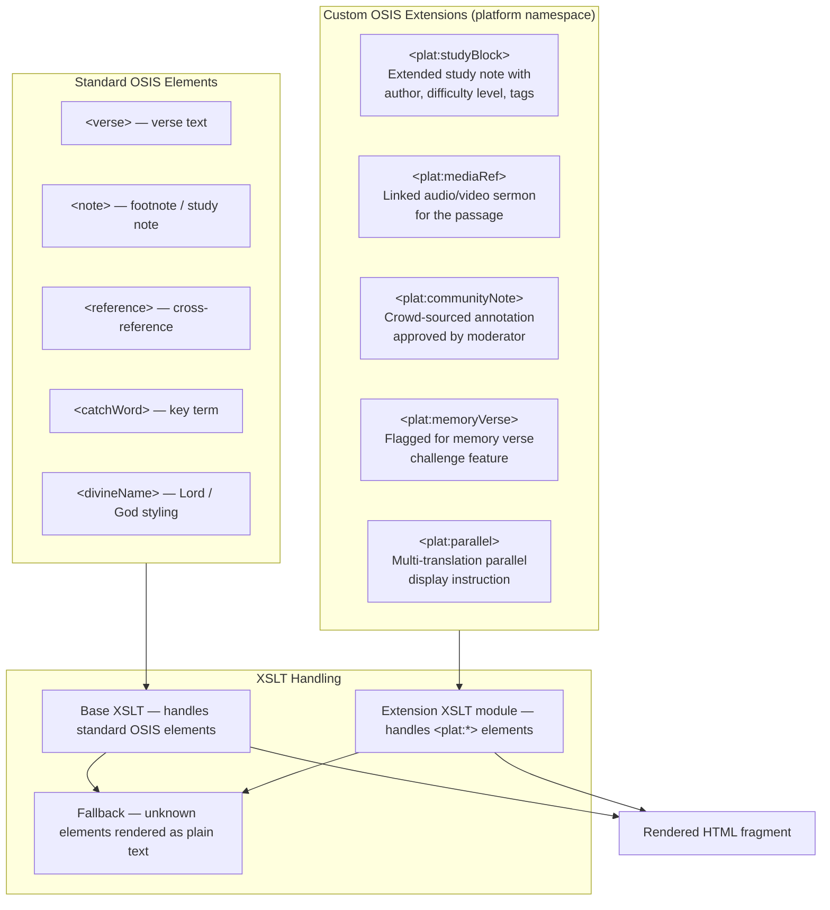
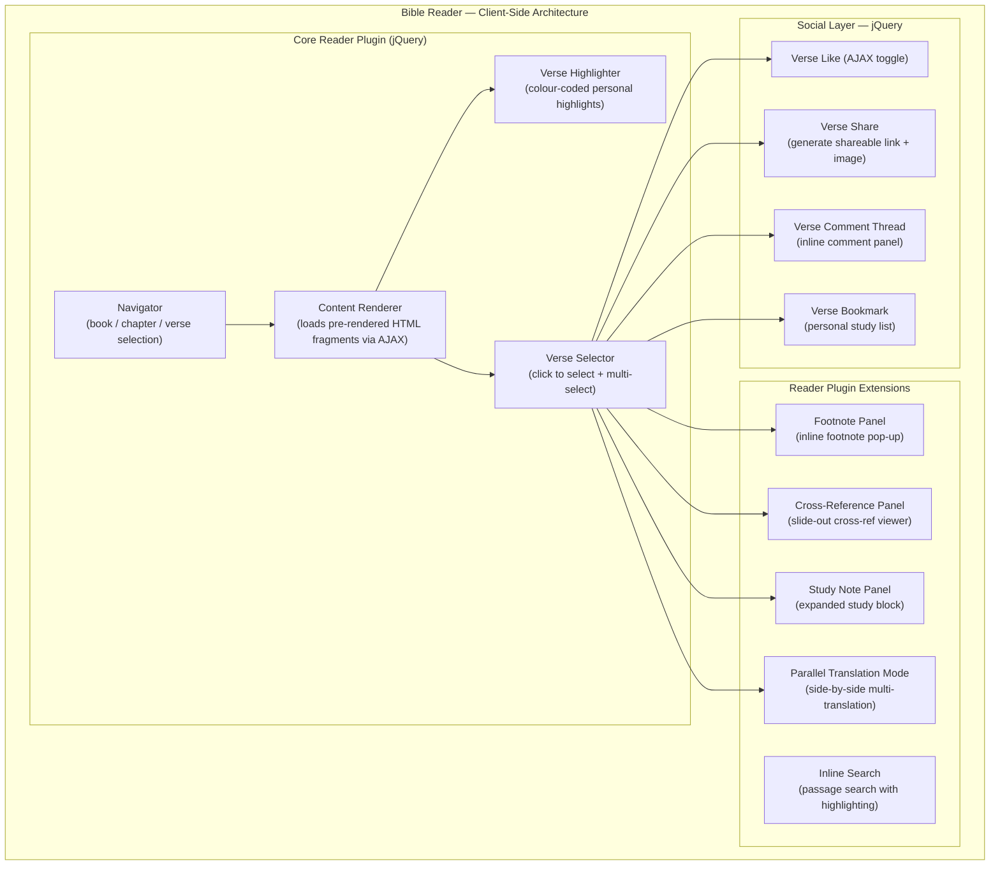
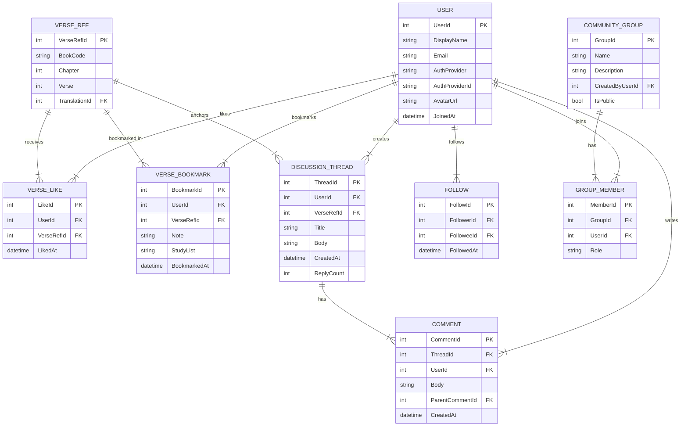
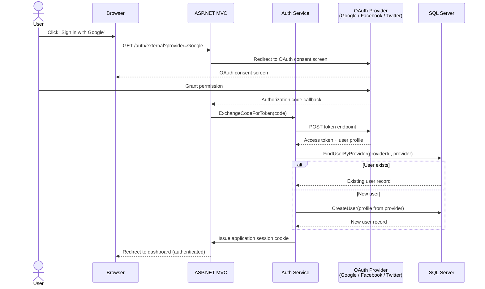
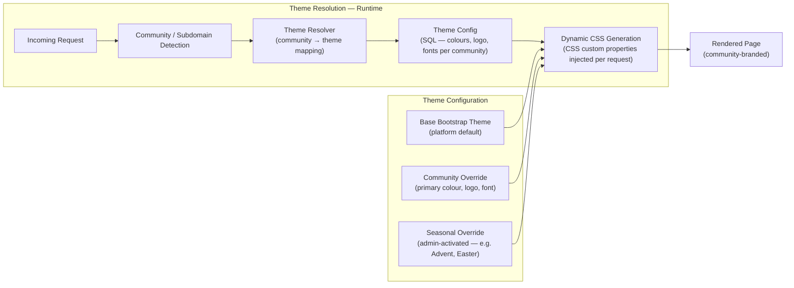

# Custom Social Networking — Bible Study Platform

> **Role:** Lead Developer
> **Domain:** Social Networking · Faith-Based Community · Content Management · Digital Publishing
> **Stack:** .NET Framework · ASP.NET MVC · C# · jQuery · Custom Bootstrap · CSS/Theming · XML · XSLT · Social Sign-In Integration

---

## Overview

Led end-to-end design and development of a custom social networking platform built around Bible study, discussion, and community engagement. The platform combines a fully functional Bible reader — supporting multiple translations and XML-based Bible standards — with social networking features including verse sharing, threaded discussion, community groups, and social authentication.

A core technical challenge was building an XML content processing engine capable of ingesting multiple Bible XML specifications (OSIS, ThML, USX), normalising them into a unified internal format, and rendering them through a customised reading experience. The OSIS specification was extended with custom elements to support platform-specific content structuring and transformation requirements beyond what the standard defined.

---

## Problem Context

Existing Bible study tools were either standalone reading applications with no community layer, or generic social platforms with no deep Bible integration. The platform aimed to bridge this gap:

- **No unified Bible reading + social experience** — users had to switch between a reading app and a separate community forum with no contextual link between the two.
- **Multiple Bible XML standards** in circulation (OSIS, ThML, USX) with no common parsing layer — integrating a new translation required custom one-off parsing work each time.
- **Verse-level interaction** was not supported by any existing open platform — liking, commenting on, or sharing a specific verse required custom implementation from the ground up.
- **Rich cross-reference and annotation content** embedded in Bible XML (study notes, footnotes, cross-references, Strong's numbers) needed to be preserved and rendered contextually — not stripped out as most parsers did.
- **Multi-translation comparison** required rendering multiple XML sources side-by-side with aligned verse structure.

---

## Goals & Non-Functional Requirements

| Requirement | Detail |
|---|---|
| Bible Reader | Interactive, paginated reader supporting multiple translations with verse-level navigation |
| Multi-Standard XML Support | Parse and render OSIS, ThML, and USX Bible XML formats through a single content pipeline |
| Extended OSIS Support | Custom OSIS extensions for platform-specific content elements not covered by the standard |
| Verse-Level Social Interaction | Like, comment, share, and bookmark at individual verse granularity |
| Discussion Threads | Threaded discussions anchored to specific passages, chapters, or verses |
| Community Features | User profiles, groups, following, activity feeds |
| Social Authentication | Sign-in via Google, Facebook, and Twitter — no mandatory account creation |
| Theming | Institution and community-specific theming without code changes |
| Performance | Bible content pre-processed and cached — no runtime XML parsing on reader page load |

---

## Architecture

### High-Level System Architecture

---

### XML Content Processing Pipeline

The content pipeline ingests Bible XML files in any supported standard, normalises them to an internal canonical format, applies XSLT transformations, and pre-processes the output into a structured content store. Reader pages are served from the pre-processed store — no runtime XML parsing occurs during reading.

---

### OSIS Extension — Custom Elements

The platform extended the OSIS XML specification with custom elements to support content types not covered by the standard. Extensions are namespaced to avoid conflict with the base specification and handled by dedicated XSLT extension modules.

---

### Bible Reader Module — jQuery Architecture

---

### Social Features — Data Model

---

### Social Authentication Flow

---

### Theming Architecture

---

## Key Technical Decisions

### Pre-Processing over Runtime XML Parsing
Bible XML files — particularly OSIS files with full study content — are large and deeply structured. Parsing and transforming them on every reader page request would have made the reader slow and CPU-intensive. The pipeline pre-processes all Bible content at import time, storing pre-rendered HTML fragments per verse in the content database. Reader page loads become simple database lookups, with no XML or XSLT processing in the request path.

### XSLT for Content Transformation
XSLT was chosen as the transformation layer over custom C# parsing code for several reasons: XSLT is specifically designed for XML-to-XML and XML-to-HTML transformation, transformation rules are declarative and independently testable, adding support for a new content rendering variant requires only a new XSLT module rather than C# code changes, and the XSLT stylesheets are versionable alongside the Bible content they process.

### Custom OSIS Extensions in a Separate Namespace
Rather than modifying the base OSIS schema — which would break OSIS-compliant validators and future compatibility — custom elements were introduced in a dedicated platform XML namespace (`xmlns:plat`). The XSLT extension module handles all `plat:*` elements; the base XSLT handles standard OSIS elements; unknown elements fall through to a plain-text renderer. This kept the extension cleanly separated and allowed standard OSIS tooling to still process the base content.

### jQuery Plugin Architecture for the Bible Reader
The reader required a cohesive, extensible UI with verse-level interaction, footnote pop-ups, cross-reference panels, and social overlays — all on a server-rendered MVC page. A jQuery plugin architecture was adopted where the core reader plugin handles navigation and content loading, and feature-specific extension plugins (footnotes, social, search) attach to the core through defined hooks. This kept each feature independently developable and testable without coupling to the core reader.

### Verse-Level Social Anchoring via VerseRef
All social interactions — likes, bookmarks, comments, discussion threads — are anchored to a `VerseRef` record (book + chapter + verse + translation). This canonical reference model means a discussion thread started on a verse in one translation can be linked to the same verse in another translation. The social graph is independent of the content format — adding a new translation does not orphan existing social content.

---

## Challenges & Solutions

| Challenge | Solution |
|---|---|
| OSIS files containing non-standard elements from different publishers | Extension namespace approach — unknown elements handled gracefully by fallback renderer rather than causing parser failure |
| Multi-translation parallel display requiring aligned verse structure | Canonical internal format normalises all translations to the same book/chapter/verse structure; parallel mode fetches pre-rendered fragments for the same VerseRef across multiple translations |
| ThML format using HTML-like tags nested inside XML — not well-formed in strict XML parsers | ThML parser pre-processes content through an HTML-to-XHTML normaliser before XML parsing; handles the common ThML publisher quirks |
| Social graph fan-out on popular verse activity feeds | Denormalised activity feed table with pre-computed feed entries on write; read from activity table rather than computing fan-out joins on every feed load |
| Community theming without CSS file proliferation | Runtime CSS custom property injection from database — single base stylesheet with CSS variables; community theme overrides only the variable values, not the stylesheet |
| Verse selector conflicting with browser text selection on mobile | Custom touch event handling in the verse selector jQuery plugin; distinguishes between text selection intent and verse selection intent based on touch duration and movement |

---

## Outcomes

| Area | Result |
|---|---|
| Bible Standard Coverage | OSIS, ThML, and USX parsed and rendered through a single content pipeline |
| Reader Performance | Bible reader page loads served from pre-processed store — no runtime XML parsing |
| Social Engagement | Verse-level likes, bookmarks, comments, and sharing fully implemented |
| Multi-Translation Support | Parallel translation comparison mode across all imported translations |
| Community Theming | Each community instance independently branded without code deployments |
| Authentication | Social sign-in via Google, Facebook, and Twitter with local account fallback |
| Extensibility | New Bible translations onboarded through import pipeline — no code changes required |

---

## Patterns Applied

| Pattern | Application |
|---|---|
| **Pipeline Pattern** | Bible XML ingestion through detect → parse → normalise → transform → index → store stages |
| **Canonical Data Model** | All Bible XML formats normalised to a single internal format before transformation |
| **Adapter Pattern** | Per-format parsers (OSIS, ThML, USX) adapt source XML to the canonical internal model |
| **Template Method** | XSLT transformation pipeline — base stylesheet defines structure; extension modules plug in per content type |
| **Pre-compute on Write** | Bible content pre-rendered at import time; reader serves from cache — no computation on read |
| **Plugin Architecture** | jQuery reader core with independently attachable extension plugins |
| **Identity Federation** | Social OAuth providers federated through a single authentication service |
| **Fan-out on Write** | Activity feed entries written at event time; feeds read without join computation |