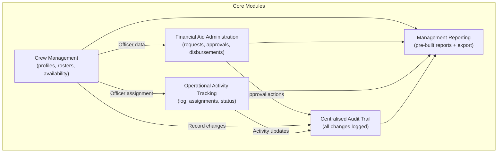
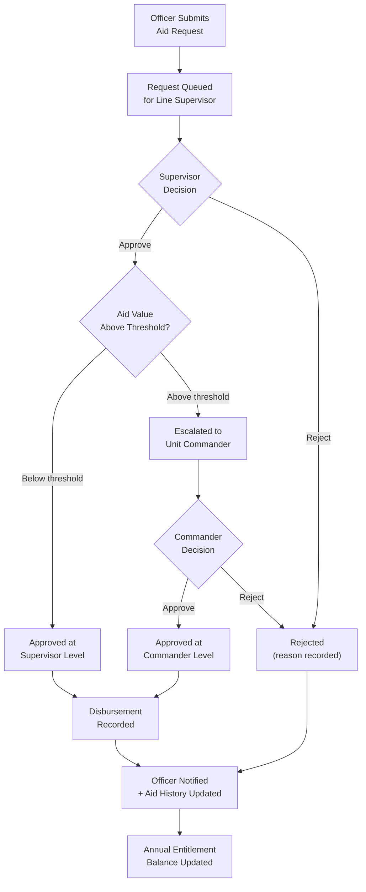
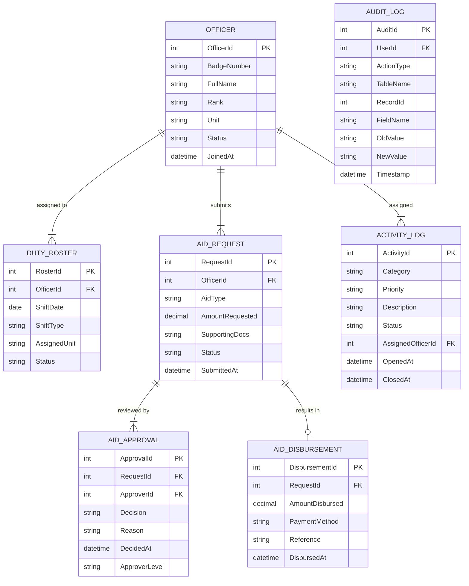

# Back Office Management System — Police Department

> **Role:** Senior Software Engineer
> **Domain:** Government · Public Safety · Internal Operations Management
> **Stack:** .NET Framework · ASP.NET · C# · jQuery · JavaScript · SQL Server · Infragistics Controls

---

## Overview

Contributed to the development and enhancement of a government back-office management system designed to automate and digitise internal administrative processes within a police department. The system managed crew operations, financial aid administration, operational activity tracking, and centralised audit logging — replacing paper-based and siloed manual processes across multiple administrative units.

Working as part of a structured development team, contributions spanned feature development, enhancement of existing modules, bug resolution, and performance improvements across the application.

---

## Business Problems Solved

The department's administrative units operated with fragmented, manual record-keeping across several core functions. Key problems addressed:

- **No centralised crew management** — officer assignments, shift scheduling, and duty records maintained in disconnected spreadsheets with no consolidated view for administrators.
- **Manual financial aid administration** — welfare and financial aid disbursements tracked on paper with no audit trail, approval workflow, or disbursement history per officer.
- **No operational activity log** — departmental activities, incidents reported through the back-office, and administrative actions had no structured, searchable record.
- **Lack of transparency** — supervisors and administrators had no real-time visibility into crew availability, pending aid requests, or activity status without physically checking with individual officers.
- **Reporting bottlenecks** — generating management reports required manual data collation from multiple paper registers and spreadsheets.

---

## What Was Built / Contributed To

### Crew Management Module
Officer profile management covering personal details, rank, unit assignment, and service record. Duty roster management — shift assignments, leave records, and availability status. Crew allocation for operational tasks with conflict detection on double-booking. Supervisor dashboard showing current duty status and availability across the unit.

### Financial Aid Administration
Aid request submission and approval workflow — officers submit requests with supporting documentation; requests routed through a defined approval chain based on aid type and value. Disbursement recording with payment method, date, and reference. Full aid history per officer with cumulative disbursement tracking against annual entitlement limits. Pending request queue for approvers with SLA indicators.

### Operational Activity Tracking
Centralised log for departmental activities — incoming reports, task assignments, follow-up actions, and closure records. Activity categorisation by type, priority, and unit. Status tracking from open through in-progress to closed with responsible officer assignment at each stage. Search and filter across the activity log by date range, type, status, and officer.

### Centralised Audit Trail
All data modifications — crew record changes, aid approvals, disbursements, and activity updates — logged to a centralised audit table capturing the user, timestamp, action type, affected record, and before/after field values. Audit log queryable by administrators for accountability and regulatory review purposes.

### Management Reporting
Pre-built reports covering crew strength by unit and shift, aid disbursements by period and category, activity volume by type and unit, and outstanding action items. Reports rendered using Infragistics grid controls with export to Excel and print capabilities.

---

## Core Module Interactions

---

## Financial Aid Approval Workflow

---

## Data Model

---

## Key Technical Contributions

**Financial aid entitlement tracking** — cumulative disbursement calculated per officer per financial year against a configurable annual entitlement cap; requests that would breach the cap flagged during submission with the remaining entitlement displayed to the requesting officer.

**Approval chain configuration** — approval routing rules defined by aid type and threshold value in a configuration table; adding a new aid category or adjusting approval thresholds required only a configuration record change, not a code deployment.

**Infragistics grid enhancements** — existing report grids enhanced with server-side paging, column-level filtering, and multi-column sorting using Infragistics WebGrid controls; large datasets previously causing timeout issues resolved by moving to server-side data operations.

**Audit trail field-level diffing** — before/after values captured at the field level for all modified records; implemented as a generic audit interceptor operating at the data access layer, capturing changes without requiring audit logic in individual feature modules.

**Activity log search and filter** — SQL Server full-text search enabled on the activity description field; combined with indexed filters on date range, status, category, and assigned officer to support fast lookup across large activity log volumes.

**Duty conflict detection** — roster assignment logic checks for existing active assignments for the same officer on the same shift date before committing; conflicts surfaced with detail of the existing assignment for supervisor review.

---

## Impact

| Area | Result |
|---|---|
| Administrative Transparency | Supervisors gained real-time visibility into crew availability, aid requests, and activity status |
| Aid Process Integrity | Structured approval workflow with audit trail replaced informal, paper-based disbursement process |
| Accountability | Field-level audit logging on all data modifications supported regulatory review requirements |
| Reporting Efficiency | Pre-built reports with export capability eliminated manual data collation from paper registers |
| Data Integrity | Duty conflict detection and entitlement cap enforcement prevented data entry errors that previously went undetected |

---

## Patterns Applied

| Pattern | Application |
|---|---|
| **Chain of Responsibility** | Aid approval routing through supervisor and commander levels based on aid type and value thresholds |
| **Audit Interceptor** | Generic field-level audit capture at the data access layer — no per-module audit logic required |
| **Configuration-Driven Workflow** | Approval chain rules and entitlement caps stored in configuration tables — no code changes for rule adjustments |
| **Server-Side Paging** | Large dataset performance managed through server-side paging and filtering on Infragistics grids |
| **Full-Text Search** | SQL Server full-text index on activity description for fast unstructured text search across the activity log |