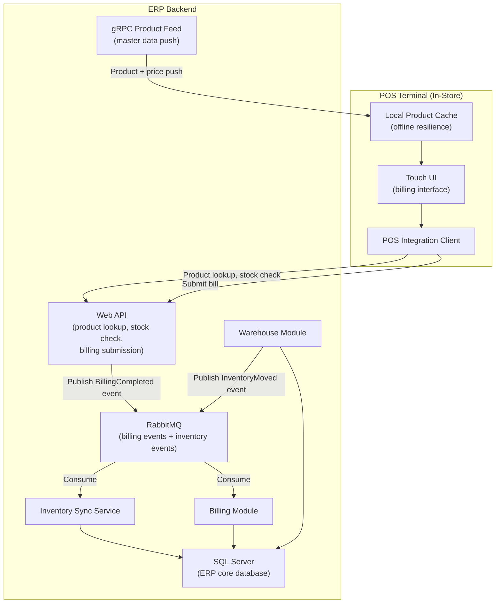
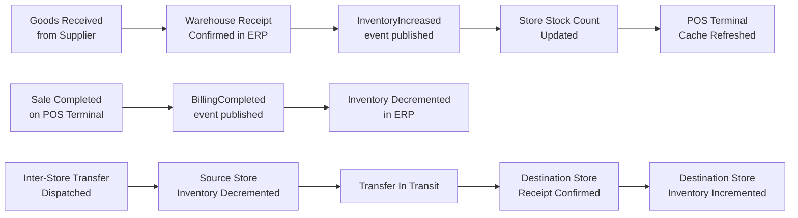
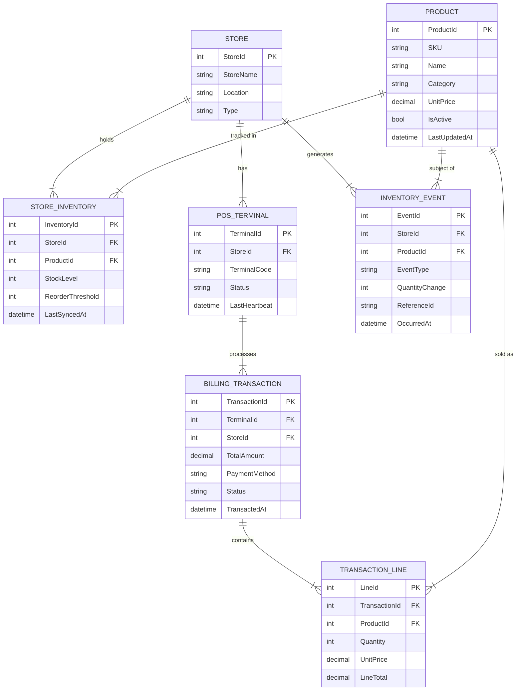

# Back Office Management System — ERP Stores

> **Role:** Software Engineer
> **Domain:** Retail · Enterprise Resource Planning · Warehouse Operations · Point of Sale
> **Stack:** .NET · C# · Web API · Azure · RabbitMQ · gRPC · SQL Server

---

## Overview

Contributed to the maintenance and enhancement of a large-scale retail ERP system automating store operations across a chain of retail outlets. The system managed warehouse operations, front-office transactions, inventory tracking, and billing workflows across multiple store locations. A key initiative during this engagement was the integration of touch-based POS terminals with the ERP system — enabling real-time billing and inventory synchronisation between in-store point-of-sale hardware and the central ERP backend.

Working as part of a larger engineering team, contributions spanned backend API development, POS integration implementation, bug resolution, and performance improvements across core ERP modules.

---

## Business Problems Solved

The retail chain operated with a growing number of store locations, each requiring consistent inventory data and billing capability. Key problems addressed:

- **POS terminals isolated from ERP** — billing terminals operated independently with no real-time connection to the central inventory system; stock levels in ERP were only updated during end-of-day batch reconciliation, causing over-selling and stock discrepancies.
- **No real-time inventory sync** — warehouse stock movements were not reflected in store-level inventory until manual reconciliation ran; store managers had no reliable view of available stock during trading hours.
- **Billing inconsistencies** — POS terminals maintained their own local product and pricing data, which drifted from the ERP master data between sync cycles; price discrepancies between POS and ERP caused reconciliation issues.
- **Manual inter-store stock transfer** — stock transfers between locations triggered manually with no automated tracking from dispatch through to receipt confirmation.

---

## What Was Built / Contributed To

### POS Terminal Integration
Designed and implemented the integration layer connecting touch-based POS terminals with the central ERP backend. The integration exposed Web API endpoints consumed by POS terminals for real-time product lookup, pricing, and stock availability checks at point of sale. Billing transactions completed on the POS terminal published to a RabbitMQ message queue for asynchronous consumption by the ERP inventory and billing modules — decoupling the POS terminal response time from ERP processing latency.

### Real-Time Inventory Synchronisation
Inventory movement events — sales, warehouse receipts, inter-store transfers, and write-offs — published as messages to RabbitMQ and consumed by an inventory sync service that maintained store-level stock counts in the ERP. Store managers and warehouse staff accessed near-real-time stock positions without waiting for batch reconciliation.

### Product & Pricing Master Data Sync
POS terminals subscribed to a product and pricing feed delivered via gRPC; ERP master data changes (new products, price updates, product discontinuations) pushed to terminals on change rather than on a fixed sync schedule. Terminals maintain a local cache of product data for offline resilience; cache invalidated and refreshed on receiving a push update from the ERP.

### Warehouse Operations
Contributed to enhancements of warehouse receiving workflows — goods receipt against purchase orders with quantity and condition validation, discrepancy reporting for short or damaged deliveries, and automatic inventory increment on confirmed receipt.

### Billing & Transaction Processing
Enhanced billing module supporting multi-tender transactions (cash, card, split payment), transaction void and refund workflows, and end-of-day till reconciliation report. Contributed to improvements in transaction throughput under concurrent billing load.

### Inter-Store Stock Transfer
Enhancement of the stock transfer workflow — transfer requests raised by destination store, approved by source store, goods dispatched and tracked in transit, and inventory adjusted at both locations on dispatch and receipt confirmation respectively.

---

## POS Integration Architecture

---

## Inventory Movement Flow

---

## Data Model — POS Integration & Inventory

---

## Key Technical Contributions

**POS Web API endpoints** — designed and implemented RESTful endpoints for product lookup by barcode/SKU, real-time stock availability check, and billing transaction submission; endpoints optimised for low-latency response given POS terminal UX sensitivity to response time.

**Asynchronous billing event processing** — billing transactions submitted to the ERP via the Web API published to RabbitMQ immediately after persistence; inventory decrement and billing module updates processed asynchronously from the consumer, decoupling POS terminal wait time from downstream ERP processing.

**gRPC product feed** — implemented server-side streaming gRPC service that pushed product master data changes to subscribed POS terminals; terminals updated their local cache on receiving a push, eliminating the stale data window that existed under the previous fixed-interval sync approach.

**Offline resilience for POS terminals** — local product cache on POS terminals allows continued billing operation during transient network outages; cached transactions queued locally and replayed to the ERP Web API on connection restoration with idempotency keys to prevent duplicate billing records.

**Inventory event log** — all inventory movements recorded as immutable event records with event type, quantity change, and a reference ID linking back to the originating transaction (billing, warehouse receipt, transfer, write-off); stock level always derivable from the event log as the source of truth, with the `STORE_INVENTORY` table maintained as a materialised running total for query performance.

**Transaction throughput improvement** — identified and resolved a locking contention issue in the billing module's end-of-day reconciliation stored procedure that was blocking concurrent transaction inserts during peak trading hours; refactored to use optimistic concurrency and reduced lock scope.

---

## Impact

| Area | Result |
|---|---|
| Stock Accuracy | Real-time inventory sync eliminated over-selling and end-of-day stock discrepancy from POS isolation |
| POS Reliability | Local cache with offline queuing allowed POS terminals to continue operating during network outages |
| Billing Consistency | Product and pricing master data pushed on change — price drift between POS and ERP eliminated |
| Transaction Throughput | Locking contention fix in reconciliation procedure resolved concurrent billing degradation during peak hours |
| Inventory Traceability | Immutable inventory event log gave a complete, auditable history of every stock movement across all locations |

---

## Patterns Applied

| Pattern | Application |
|---|---|
| **Event-Driven Inventory** | Inventory movements published as events consumed asynchronously by the inventory sync service |
| **Local Cache with Offline Queue** | POS terminals cache product data and queue transactions locally for resilience during network outages |
| **Idempotent Consumer** | Offline transaction replay handled with idempotency keys to prevent duplicate billing records |
| **Materialised Aggregate** | `STORE_INVENTORY` maintained as a running total materialised from the inventory event log |
| **Server-Side Streaming gRPC** | Product master data changes streamed to subscribed POS terminals on change rather than polled on a schedule |
| **Optimistic Concurrency** | Billing reconciliation refactored to reduce lock contention under concurrent transaction load |