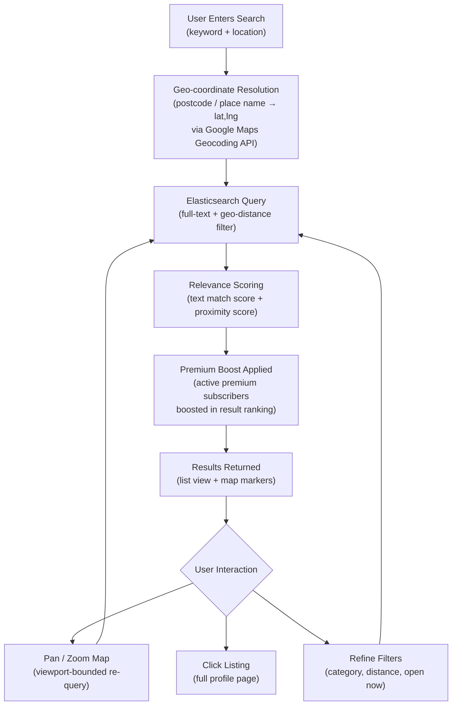
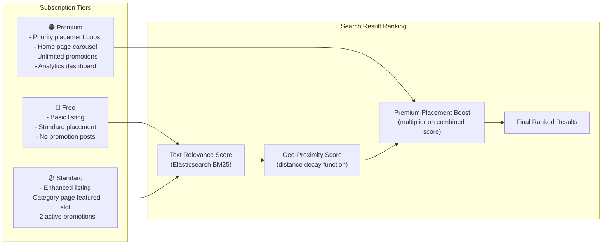
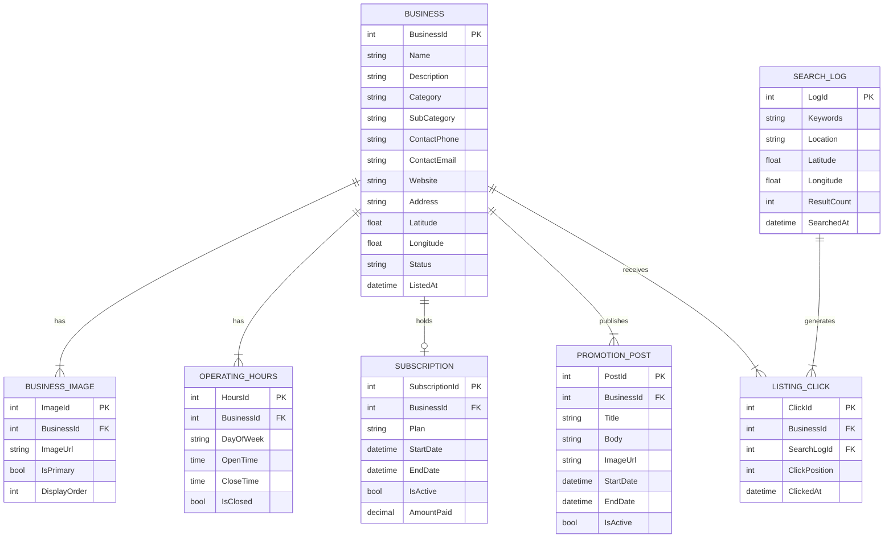

# Business Directory Platform

> **Role:** Lead Developer
> **Domain:** Local Business Discovery · Directory & Listings · Location-Based Search · Subscription Monetisation
> **Stack:** .NET Framework · ASP.NET MVC · C# · jQuery · AJAX · SQL Server · Elasticsearch · Google Maps API · Bootstrap · CSS

---

## Overview

Designed and developed a business directory platform enabling businesses to list, promote, and prioritise their services through a searchable public directory. The platform supports map-based discovery, location-aware search powered by Elasticsearch, and a subscription-based monetisation model where premium subscribers receive prioritised placement in search results and category listings.

The core technical challenge was building a search and discovery experience that was both geographically relevant and commercially sustainable — balancing organic relevance with premium placement rules in a way that felt natural to the end user.

---

## Business Problems Solved

Local businesses had no affordable, specialised directory platform for their region or sector. General-purpose directories were expensive, generic, and not optimised for location-aware discovery. Specific problems addressed:

- **No geo-aware local discovery** — existing options did not surface businesses based on the searcher's location or a specified area with map visualisation.
- **No category-specific directory** — generic directories mixed unrelated business types; this platform targeted a specific sector with curated categories.
- **No tiered visibility model** — all listings treated equally regardless of investment; no incentive mechanism for businesses to promote their listing above competitors.
- **No self-service listing management** — businesses had to contact directory operators to update their information; no admin portal for self-managed profiles.
- **Static listings** — no way for businesses to publish offers, announcements, or seasonal promotions alongside their core listing.

---

## What Was Built

### Business Listing Management
Self-service business profile creation and management — business name, description, category, sub-category, contact details, operating hours, website, and social links. Multi-image gallery per listing with primary image selection. Listing status management — draft, pending review, active, and suspended. Admin review workflow for new listing approval before publication.

### Location-Aware Search
Elasticsearch-powered full-text search across business name, description, category, and tags. Geo-distance filtering — search results filtered and sorted by proximity to a specified location or the user's detected location. Combined text + geo query — keyword relevance score and geo-distance combined into a unified result ranking, with premium placement rules applied as a final boost layer.

### Map-Based Discovery
Google Maps API integration displaying search results as map markers with info-window previews. Map viewport-bounded search — as the user pans or zooms the map, search results update to reflect the visible area. Cluster markers for dense result areas to keep the map readable at lower zoom levels. Click-through from map marker to full business listing page.

### Premium Placement & Subscription Model
Tiered subscription plans — free, standard, and premium — each with defined placement benefits. Premium subscribers receive a configurable placement boost in search results and appear in featured listing carousels on category and home pages. Subscription management with plan selection, renewal reminders, and expiry-based automatic demotion back to free placement.

### Business Promotion Posts
Active listings can publish time-limited promotion posts — special offers, announcements, new service launches — displayed on the listing page and surfaced in a promotions feed on the directory home page. Promotions carry a start and end date with automatic expiry.

### Admin Portal
Listing approval queue, subscription management, category and sub-category taxonomy management, featured listing curation, and directory-wide search analytics — top search terms, zero-result queries, and click-through rates per listing.

---

## Search & Discovery Flow

---

## Premium Placement Model

---

## Data Model

---

## Key Technical Implementations

**Elasticsearch geo-distance query** — business locations indexed as `geo_point` fields in Elasticsearch; search queries combine a `multi_match` query across name, description, and tags with a `geo_distance` filter scoped to the specified radius. Results scored using a `function_score` query that decays the relevance score with distance using a Gaussian decay function.

**Premium placement boost** — applied as a `function_score` boost factor in the Elasticsearch query for businesses with an active premium subscription; boost factor configurable per subscription tier without code changes, stored in the directory configuration table.

**Viewport-bounded map search** — Google Maps `bounds_changed` event triggers a debounced AJAX re-query passing the current map viewport as a bounding box; Elasticsearch `geo_bounding_box` filter applied instead of geo-distance for viewport queries, returning only businesses within the visible map area.

**Marker clustering** — Google Maps MarkerClusterer library groups nearby markers at lower zoom levels; cluster count displayed on the cluster icon; expanding a cluster on zoom reveals individual business markers.

**Zero-result query detection** — all searches logged with result count; queries returning zero results surfaced in the admin analytics panel, identifying gaps in category coverage or location reach to inform directory expansion decisions.

**Subscription expiry automation** — a scheduled background job checks subscription expiry daily; expired subscriptions demoted to free tier automatically with the business owner notified by email and prompted to renew.

---

## Impact

| Area | Result |
|---|---|
| Discovery Experience | Location-aware search with map visualisation gave users a spatial context for results not possible with list-only directories |
| Business Reach | Self-service listing management eliminated operator bottleneck — businesses could publish and update their own profiles |
| Monetisation | Tiered subscription model with measurable placement benefits gave businesses a clear value proposition for upgrading |
| Search Intelligence | Zero-result query tracking informed directory operators of coverage gaps and emerging search demand |
| Promotional Capability | Time-limited promotion posts gave businesses a lightweight content channel within their listing |

---

## Patterns Applied

| Pattern | Application |
|---|---|
| **Geo-Spatial Search** | Elasticsearch `geo_point` indexing with distance decay scoring and bounding box filter for map viewport queries |
| **Function Score Query** | Premium placement boost applied as a configurable multiplier within the Elasticsearch relevance scoring pipeline |
| **Debounce** | Map `bounds_changed` event debounced before triggering search re-query — prevents excessive API calls during pan/zoom |
| **Scheduled Job** | Daily subscription expiry check and automatic tier demotion |
| **Analytics Logging** | All searches and click-throughs logged for zero-result detection and listing performance analytics |
| **MVC + Repository** | Controller → Service → Repository separation throughout |