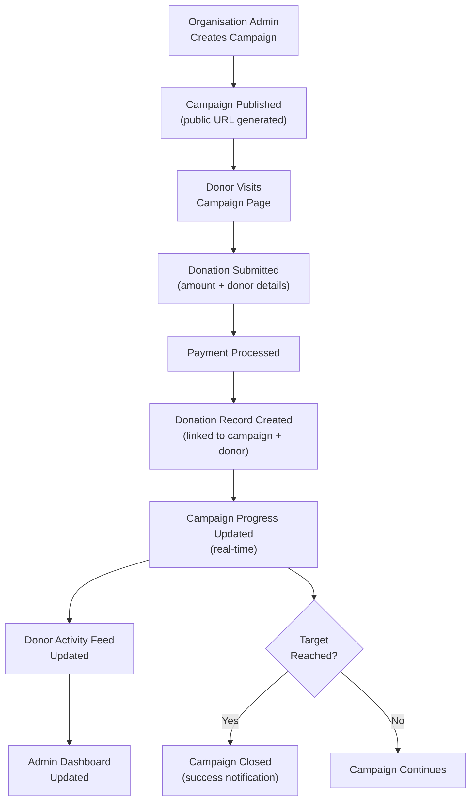
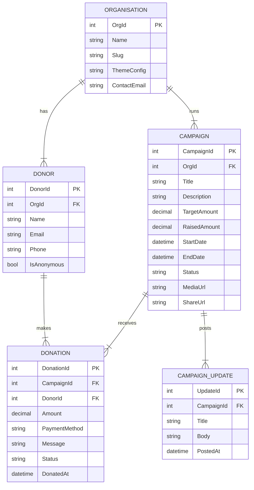

# Business Process Automation — Donation Management System

> **Role:** Lead Developer
> **Domain:** Non-Profit · Fundraising · Campaign Management · Donor Engagement
> **Stack:** .NET Framework · ASP.NET MVC · C# · jQuery · SQL Server · CSS · Custom Theming

---

## Overview

Designed and developed a web-based donation management platform enabling non-profit organisations and cause-driven groups to create fundraising campaigns, engage donors, and track progress toward funding goals. The system comprised a public-facing campaign website for donor engagement and a secure administrative portal for campaign and donation management.

The platform was built as a multi-tenant solution — multiple organisations operate independently on the same platform, each with isolated campaign data, donor records, and a branded instance.

---

## Business Problems Solved

Organisations running fundraising campaigns had no dedicated digital platform. Donations were collected through generic payment links with no campaign context, no progress visibility, and no donor engagement tooling. Specific problems addressed:

- **No cause-specific campaign pages** — donors had no way to understand what they were contributing to or see collective progress toward a funding goal.
- **No donation tracking** — organisations could not see who donated, how much, or when, without manual bank reconciliation.
- **No campaign performance analytics** — campaign managers had no insight into which campaigns were performing, donor retention rates, or peak donation periods.
- **No multi-organisation support** — each organisation needed isolated campaign management and donor data without cross-tenant visibility.
- **No donor engagement layer** — there was no mechanism to show donors the impact of their contribution or keep them updated on campaign progress.

---

## What Was Built

### Campaign Management
Create and manage fundraising campaigns with title, description, target amount, duration, media (images and video embed), and cause category. Supports draft, active, paused, and closed campaign states with scheduled activation and automatic closure on target date. Each campaign carries a unique shareable URL for social promotion.

### Public Campaign Portal
Donor-facing website listing active campaigns with real-time progress bars, donation counts, recent donor activity feed, and time-remaining indicators. Supports anonymous and named donations with an optional personal message displayed on the campaign page. Mobile-responsive layout for donation on any device.

### Donation Processing
Donation intake with amount validation, donor details capture, and a multi-step confirmation flow. Each donation is linked to a campaign and donor record. Supports both fixed-amount and open-amount donation options per campaign configuration. Cash and cheque donations recordable manually by administrators alongside online payments.

### Donor Management
Donor profiles consolidating all donations across campaigns within the same organisation. Donor communication log for thank-you messages and campaign updates. Export capability for offline donor reporting and tax receipt generation.

### Administrative Dashboard
Campaign performance overview showing total raised, donor count, average donation value, and projected time-to-goal based on current donation velocity. Daily and weekly donation trend charts per campaign. Organisation-level summary across all active campaigns.

### Configurable Theming
Each organisation operates a branded instance with a custom colour scheme, logo, and campaign category taxonomy managed through admin settings — no code deployments required for new organisation onboarding.

---

## Campaign & Donation Flow

---

## Data Model

---

## Key Technical Implementations

**Real-time progress calculation** — campaign progress percentage, days remaining, and projected completion date computed from current donation velocity (rolling 7-day average donation rate) and displayed on every campaign page load.

**Donor deduplication** — email-based donor identity resolution across multiple campaigns within the same organisation; a returning donor's new donation is linked to their existing profile rather than creating a duplicate record.

**Anonymous donation handling** — donors can choose to donate anonymously; the donor record is created with an anonymised display name for the activity feed while the full details remain accessible to administrators for audit and tax purposes.

**Multi-step donation flow** — amount selection → donor details → confirmation summary → payment → thank-you page; each step validates independently with clear error messaging before proceeding.

**Custom CSS theming** — organisation-specific theme loaded at runtime from a database configuration record; a single base stylesheet uses CSS custom properties overridden per-organisation without generating separate stylesheets per tenant.

**Campaign velocity projection** — rolling donation rate used to project estimated days to goal, surfaced on both the admin dashboard and the public campaign page to create urgency for donors.

---

## Impact

| Area | Result |
|---|---|
| Donor Engagement | Cause-specific campaign pages with live progress replaced generic payment links |
| Transparency | Real-time progress bars and donor activity feeds built contributor trust |
| Administrative Efficiency | Donation tracking and analytics replaced manual spreadsheet reconciliation |
| Multi-Tenancy | Multiple organisations independently managed and branded on a single platform |
| Donor Retention | Donor profiles with cross-campaign history enabled targeted re-engagement communication |

---

## Patterns Applied

| Pattern | Application |
|---|---|
| **Multi-Tenancy** | Organisation-scoped data isolation with per-tenant theming from shared infrastructure |
| **State Machine** | Campaign lifecycle managed through defined states — draft → active → paused → closed |
| **Identity Resolution** | Email-based donor deduplication across campaigns within the same organisation |
| **MVC** | Controller → Service → Repository layering with Razor views |
| **CSS Custom Properties** | Runtime theme injection via CSS variables from database config — no per-tenant stylesheet generation |