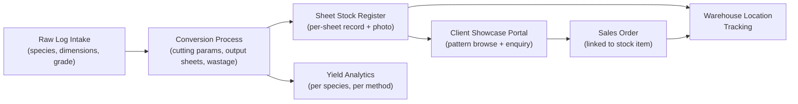
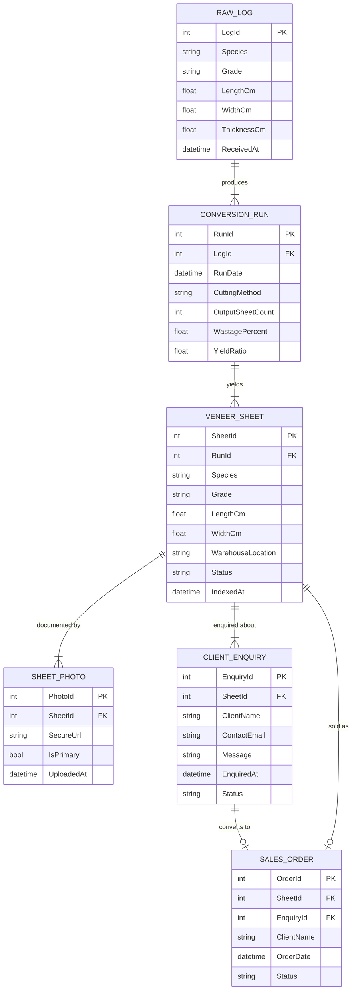

# Business Process Automation — Wood Veneer Processing Factory

> **Role:** Lead Developer
> **Domain:** Manufacturing · Inventory Management · Production Workflow Automation
> **Stack:** .NET Framework · ASP.NET MVC · C# · jQuery · Bootstrap · jQuery Plugins · SQL Server · Secure Image Storage

---

## Overview

Designed and developed a business process automation system for a wood veneer manufacturing factory, replacing entirely manual, paper-based operations with a web-based platform. The factory deals in natural wood veneers — each sheet carrying a unique grain pattern — making visual identification, traceability, and client-facing presentation central requirements alongside standard inventory management.

---

## Business Problems Solved

The factory operated with no digital record-keeping. Stock was tracked on paper ledgers, veneer pattern identification relied on worker memory, and the sales process had no way to present available stock to clients remotely. Key problems addressed:

- **No digital stock register** — raw log intake, conversion batches, and finished veneer sheets all tracked manually on paper with no audit trail.
- **No conversion tracking** — the process of cutting a raw log into veneer sheets, including yield and wastage, was unrecorded.
- **Pattern identification gap** — natural veneer patterns are unique per sheet; without photo documentation, matching a customer's pattern preference to available stock meant physically walking the warehouse.
- **No client-facing sales channel** — sales relied entirely on clients visiting the factory to view available stock in person.

---

## What Was Built

### Stock Management Module
Digital register for raw log intake, sheet-level veneer inventory, and stock movement across warehouse locations. Each item carries species, grade, dimensions, and quantity with a full entry and exit audit trail. Batch entry supports intake of multiple sheets from a single conversion run with validation before commit.

### Veneer Conversion Tracker
Records the conversion of a raw log into saleable veneer sheets. Captures input log details, cutting parameters, output sheet count, per-sheet dimensions, and wastage percentage. Feeds a yield analytics report comparing conversion ratios across species and cutting methods — informing raw material procurement decisions.

### Pattern Identification & Photo Documentation
Each veneer sheet photographed at intake and linked to its stock record. A jQuery-based image viewer with zoom and side-by-side comparison allows warehouse staff and sales team to visually match a customer's pattern request against available stock without a physical warehouse search.

### Client Showcase Portal
Public-facing product gallery presenting available veneer stock browsable by species, grade, and pattern with photo browsing. Supports direct enquiry submission linked to specific stock items, giving remote clients the ability to identify and express interest in stock without a site visit.

---

## Production & Stock Flow

---

## Key Technical Implementations

**Secure image storage** — warehouse photography stored with access-controlled URLs; raw file paths never exposed to the client browser.

**jQuery image comparison plugin** — side-by-side pattern matching tool for sales staff, built on a customised jQuery UI plugin with zoom synchronisation between panes.

**Batch stock entry with validation** — bulk import of converted sheet batches with dimension, grade, and duplicate detection validation before database commit; invalid rows flagged per-row without rejecting the entire batch.

**Yield calculation engine** — per-conversion yield ratio computed from input log volume and output sheet area; aggregated into species-level and method-level analytics surfaced in operational reports.

**Enquiry-to-stock linking** — client enquiries submitted from the showcase portal carry a direct reference to the specific stock item; the admin portal surfaces enquiries against the relevant stock record for sales follow-up.

---

## Data Model

---

## Impact

| Area | Result |
|---|---|
| Stock Visibility | Real-time digital inventory replaced paper ledgers — stock levels accurate at all times |
| Pattern Traceability | Every veneer sheet traceable by photo from raw log through to sale |
| Sales Reach | Client showcase portal enabled remote stock browsing — reduced dependency on factory visits for sales |
| Yield Insight | Conversion analytics surfaced per-species and per-method yield rates to inform procurement |
| Operational Audit | Full entry/exit audit trail on all stock movements — previously unrecorded |

---

## Patterns Applied

| Pattern | Application |
|---|---|
| **MVC** | Clean separation of controller logic, service layer, and Razor view rendering |
| **Repository Pattern** | Data access abstracted from business logic; SQL operations behind repository interfaces |
| **Batch Validation** | Row-level validation with partial success — invalid rows flagged without rejecting the whole batch |
| **Secure Direct URL** | Time-limited signed URLs for image access — raw storage paths never exposed |