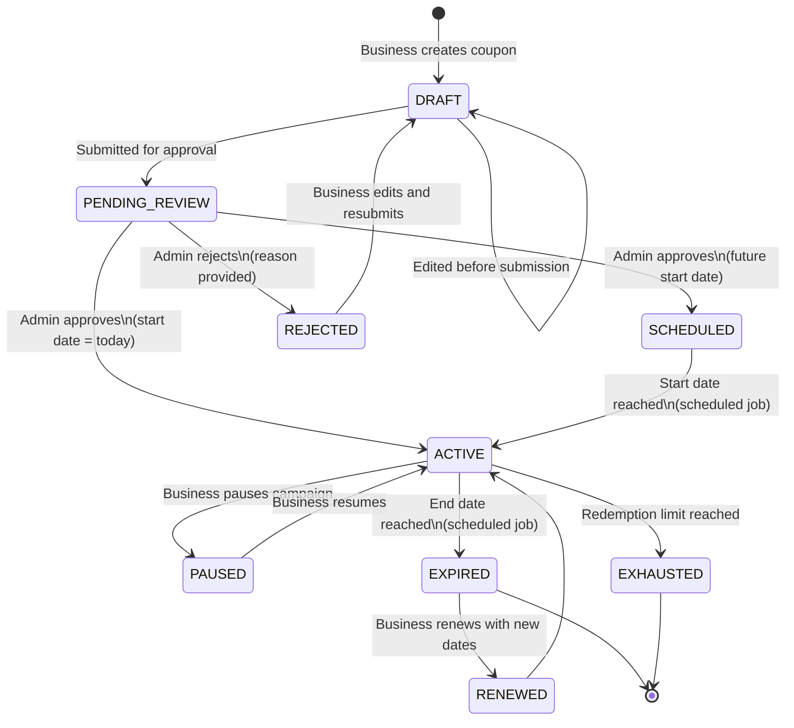
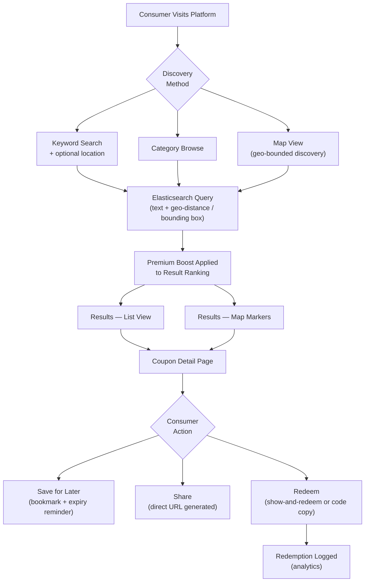
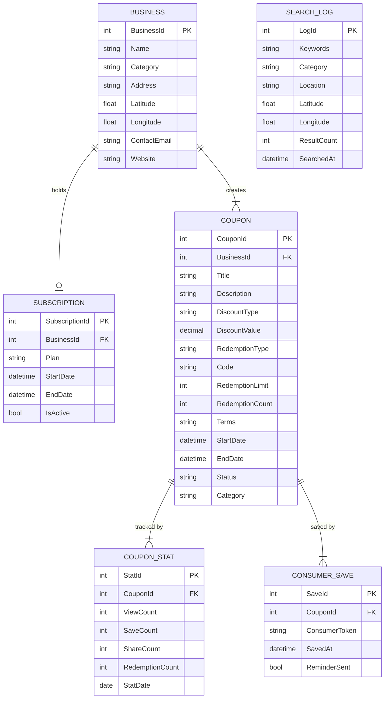

# Coupons Directory & Promotion Platform

> **Role:** Lead Developer
> **Domain:** Coupon Management · Promotional Marketing · Local Business · Subscription Monetisation
> **Stack:** .NET Framework · ASP.NET MVC · C# · jQuery · JavaScript · AJAX · SQL Server · Elasticsearch · Google Maps API · Bootstrap · CSS

---

## Overview

Led the design and development of a coupon management and promotion platform enabling businesses to create, manage, and promote discount campaigns to a geographically targeted consumer audience. The platform comprises a consumer-facing coupon discovery website and an administrative portal for businesses to manage their listings, subscription tiers, and campaign performance.

Coupon visibility and placement are governed by a subscription tier model — businesses on higher tiers receive featured placement, while free-tier listings appear in standard search results. Location-aware search via Elasticsearch and Google Maps enables consumers to discover relevant deals near them or in a specified area.

---

## Business Problems Solved

Businesses running promotional campaigns had no affordable, location-targeted platform to reach nearby consumers actively looking for deals. General coupon aggregators were national in scope with no local focus. Specific problems addressed:

- **No location-targeted coupon discovery** — existing platforms surfaced coupons by brand nationally with no proximity-based filtering for locally relevant deals.
- **No self-service campaign management** — businesses had to submit coupons through intermediaries with no direct control over campaign content, timing, or duration.
- **No tiered visibility incentive** — all coupons treated equally regardless of business investment; no mechanism to reward higher-tier subscribers with better placement.
- **No campaign performance visibility** — businesses had no data on how many consumers viewed or claimed their coupons.
- **Short-lived promotions with no scheduling** — businesses needed to run time-limited offers with automatic expiry, which manual management could not reliably handle.

---

## What Was Built

### Coupon Campaign Management
Self-service coupon creation — offer title, description, discount value or percentage, terms and conditions, redemption instructions, validity period, and category. Supports single-use codes, multi-use codes, and show-and-redeem coupons (no unique code — customer shows the coupon at point of sale). Campaign scheduling with start and end dates, automatic expiry, and optional renewal prompts.

### Consumer-Facing Coupon Discovery
Category-browsable coupon feed with keyword search and location-based filtering. Featured coupon carousel on the homepage for premium subscribers. Coupon detail page with redemption instructions, terms, expiry countdown, and business profile link. Save-for-later functionality — consumers bookmark coupons to a personal list with expiry reminders. Share functionality generating a direct coupon URL for social distribution.

### Location-Aware Search
Elasticsearch-powered search across coupon title, description, business name, and category with geo-distance filtering based on the associated business location. Consumers can search by keyword, browse by category, or discover deals near a specified location displayed on a Google Maps interface with coupon markers.

### Subscription Tier & Featured Placement
Tiered subscription plans defining placement benefits — free listings appear in standard search results; standard and premium subscribers appear in category featured slots and homepage carousels respectively. Placement boost applied within Elasticsearch scoring for active premium subscribers. Subscription lifecycle managed with expiry-based automatic demotion and renewal notification flow.

### Campaign Performance Dashboard
Business-facing analytics — coupon view count, save count, share count, and redemption count (where tracked) per campaign. Trend charts showing daily views and saves over the campaign duration. Comparative performance across campaigns within the same subscription period.

### Admin Portal
Coupon approval workflow for new submissions, business account management, subscription management, taxonomy (category) management, and platform-wide analytics — top-performing coupons, most-searched categories, and geographic heat map of consumer search activity.

---

## Coupon Lifecycle

---

## Discovery & Search Flow

---

## Data Model

---

## Key Technical Implementations

**Elasticsearch coupon index** — coupons indexed with business geo-point, category, and full-text fields. Active coupons filtered by current date range at query time using a `range` filter on `startDate` / `endDate`. Expired and inactive coupons excluded from consumer-facing queries without deletion from the index — status filter applied at query level, preserving historical data for analytics.

**Premium placement boost** — `function_score` query applies a configurable boost multiplier to coupons belonging to businesses with an active premium subscription. Boost factor loaded from configuration per tier, applied during query construction rather than at index time — subscription tier changes take effect on the next search without requiring re-indexing.

**Geo-bounded map search** — map viewport coordinates passed as a `geo_bounding_box` filter; result set limited to coupons whose associated business location falls within the visible map area. Debounced on map pan and zoom events to avoid excessive query volume.

**Expiry reminder for saved coupons** — a scheduled background job runs daily, identifies saved coupons expiring within 48 hours where a reminder has not yet been sent, and queues reminder notifications to the consumer. `ReminderSent` flag updated atomically to prevent duplicate reminders on repeated job runs.

**Redemption limit enforcement** — redemption count incremented with an optimistic concurrency check against the configured limit; attempts to redeem an exhausted coupon are rejected at the service layer before any state change is persisted. Coupon automatically transitioned to `EXHAUSTED` state when the limit is reached.

**Consumer token for anonymous saves** — consumers can save coupons without registering; a browser-persisted token identifies the consumer's saved list. Token associated with saved coupon records; if the consumer later registers, their token is linked to their new account, preserving their saved list.

**Daily stat aggregation** — coupon view, save, share, and redemption events written as lightweight event records throughout the day; a nightly scheduled job aggregates these into the `COUPON_STAT` daily summary table used for dashboard queries, keeping analytics queries fast without scanning the raw event log.

---

## Impact

| Area | Result |
|---|---|
| Business Autonomy | Self-service campaign management replaced operator-mediated submission process |
| Consumer Discovery | Location-aware search and map view surfaced locally relevant deals not possible on national platforms |
| Campaign Lifecycle | Automated scheduling, expiry, and status transitions eliminated manual campaign management overhead |
| Monetisation | Tiered subscription with measurable placement benefits gave businesses a clear reason to upgrade |
| Performance Insight | Per-campaign analytics gave businesses data to evaluate promotional effectiveness for the first time |

---

## Patterns Applied

| Pattern | Application |
|---|---|
| **State Machine** | Coupon lifecycle from draft through approval, scheduling, active, paused, expired, and exhausted states |
| **Function Score Query** | Premium boost applied as a configurable tier multiplier within Elasticsearch relevance scoring |
| **Optimistic Concurrency** | Redemption limit enforced with atomic count check to prevent over-redemption under concurrent requests |
| **Scheduled Aggregation** | Raw event records aggregated nightly into daily stat summaries — analytics queries served from summaries |
| **Anonymous Identity** | Browser token preserves consumer saved list without requiring registration |
| **Debounce** | Map viewport search re-query debounced on pan/zoom to control Elasticsearch query volume |
| **Soft Filter on Index** | Expired coupons excluded via query-time status and date filter — not deleted from index, preserving analytics history |