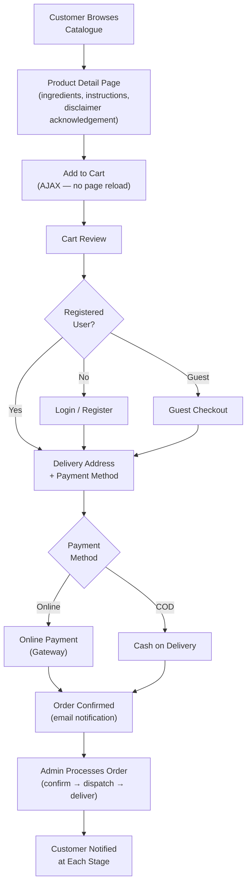

# E-Commerce Platform — Ayurvedic Cosmetics & Medicines

> **Role:** Lead Developer
> **Domain:** E-Commerce · Health & Wellness · Retail · Online Payments
> **Stack:** .NET Framework · ASP.NET MVC · C# · jQuery · AJAX · SQL Server · Payment Gateway Integration · CSS · Bootstrap

---

## Overview

Designed and developed a full-stack e-commerce platform for a retailer specialising in Ayurvedic cosmetics and medicinal products. The platform comprised a customer-facing storefront for product discovery and purchase, and an administrative portal for product catalogue, inventory, and order lifecycle management.

The platform was purpose-built for the Ayurvedic retail context — handling the specific needs of medicinal product cataloguing (ingredient listings, usage instructions, contraindications, regulatory disclaimers) that generic e-commerce templates did not support out of the box.

---

## Business Problems Solved

The retailer operated exclusively through a physical store with no online presence, limiting reach to walk-in customers only. Specific problems addressed:

- **No online sales channel** — products only purchasable in-store; no way for customers outside the local area to browse or buy.
- **Medicinal product cataloguing gap** — Ayurvedic medicinal products require ingredient transparency, usage guidance, and regulatory disclaimers not supported by generic product listing templates.
- **Manual order processing** — phone and in-person orders tracked on paper with no structured pipeline for fulfilment tracking or customer communication.
- **No inventory visibility** — stock levels managed by manual counting; no low-stock alerting or reorder tracking.
- **No sales analytics** — no visibility into top-selling products, seasonal trends, or revenue by category.

---

## What Was Built

### Product Catalogue
Categorised product browser with filter and search by product type (cosmetic / medicinal), condition, key ingredient, and brand. Each product page includes a full ingredient list, usage instructions, contraindications, shelf life, and a regulatory disclaimer field — mandatory for medicinal product categories. Supports product variants (size, pack quantity) with independent pricing and stock per variant.

### Customer Storefront
Product discovery with category navigation, keyword search, and featured product sections. Wishlist for saving products across sessions. AJAX-based cart with add, update quantity, and remove without page reload. Guest checkout alongside registered account flow with saved address and order history.

### Payment Integration
Online payment processing via payment gateway with order status updated on payment confirmation and failure webhooks. Idempotent webhook handler prevents duplicate order state transitions on repeated gateway callbacks. Cash-on-delivery supported as a secondary payment method with manual confirmation by admin.

### Order Management
Order processing pipeline with states: pending → confirmed → dispatched → delivered → returned. Customer notification triggered at each state transition. Bulk order export for dispatch partner integration. Return and refund request handling with admin approval workflow.

### Inventory Management
Stock level tracking per product variant with configurable low-stock threshold alerts. Reorder flag raised automatically when stock falls below threshold. Purchase order recording for stock replenishment with expected delivery date tracking.

### Sales Analytics
Revenue by category, top-selling products by volume and value, daily and monthly order trends, and average order value — surfaced in the admin dashboard. Product performance report exportable for offline analysis.

---

## Customer Purchase Flow

---

## Data Model

```mermaid
erDiagram
    PRODUCT {
        int ProductId PK
        string Name
        string Category
        string ProductType
        string Ingredients
        string UsageInstructions
        string Contraindications
        string RegulatoryDisclaimer
        bool RequiresDisclaimer
        bool IsActive
    }

    PRODUCT_VARIANT {
        int VariantId PK
        int ProductId FK
        string Size
        string PackQuantity
        decimal Price
        int StockLevel
        int LowStockThreshold
        string SKU
    }

    CUSTOMER {
        int CustomerId PK
        string Name
        string Email
        string Phone
        bool IsGuest
    }

    ADDRESS {
        int AddressId PK
        int CustomerId FK
        string Line1
        string Line2
        string City
        string State
        string Pincode
    }

    ORDER {
        int OrderId PK
        int CustomerId FK
        int AddressId FK
        decimal TotalAmount
        string PaymentMethod
        string PaymentStatus
        string OrderStatus
        datetime PlacedAt
    }

    ORDER_ITEM {
        int ItemId PK
        int OrderId FK
        int VariantId FK
        int Quantity
        decimal UnitPrice
    }

    WISHLIST {
        int WishlistId PK
        int CustomerId FK
        int ProductId FK
        datetime AddedAt
    }

    PRODUCT ||--|{ PRODUCT_VARIANT : "has"
    PRODUCT ||--|{ WISHLIST : "saved in"
    CUSTOMER ||--|{ ORDER : "places"
    CUSTOMER ||--|{ ADDRESS : "has"
    CUSTOMER ||--|{ WISHLIST : "owns"
    ORDER ||--|{ ORDER_ITEM : "contains"
    PRODUCT_VARIANT ||--|{ ORDER_ITEM : "ordered as"
```

---

## Key Technical Implementations

**AJAX cart** — add-to-cart, quantity update, and removal handled via AJAX without page reload; cart state persisted server-side for authenticated users and in a session cookie for guests, merged on login.

**Regulatory disclaimer acknowledgement** — medicinal product pages display a mandatory disclaimer with an explicit acknowledgement checkbox before add-to-cart is enabled; acknowledgement recorded against the order for audit purposes.

**Idempotent payment webhook handler** — payment gateway callbacks processed with idempotency key check; duplicate callbacks for the same payment are detected and ignored without re-triggering order state transitions or duplicate confirmation emails.

**Product variant matrix** — size and pack quantity combinations managed as independent variant records each with their own SKU, price, and stock level; variant selection on the product page updates price and availability display dynamically via AJAX.

**Low-stock alert engine** — stock level checked on every order fulfilment; variants falling below configured threshold flagged in the admin dashboard and optionally surfaced as email alerts to the purchasing team.

---

## Impact

| Area | Result |
|---|---|
| Sales Channel | Physical-only retailer extended to a fully operational online store |
| Product Transparency | Ingredient lists, usage guidance, and disclaimers gave customers confidence in medicinal purchases |
| Order Fulfilment | Structured order pipeline replaced paper-based tracking — fulfilment errors reduced |
| Inventory Control | Real-time stock levels with low-stock alerts replaced manual counting |
| Customer Reach | Online presence opened sales to customers outside the local geographic area |

---

## Patterns Applied

| Pattern | Application |
|---|---|
| **State Machine** | Order lifecycle managed through defined states with valid transition rules |
| **Idempotent Consumer** | Payment webhook handler detects and ignores duplicate gateway callbacks |
| **Session Merge** | Guest cart merged into authenticated user cart on login |
| **MVC + Repository** | Controller → Service → Repository layering throughout |
| **Variant Pattern** | Product variants as independent entities with own pricing and stock — not attributes on the base product |