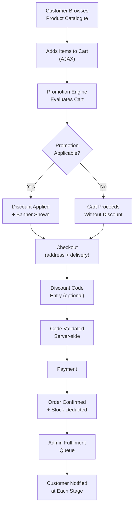
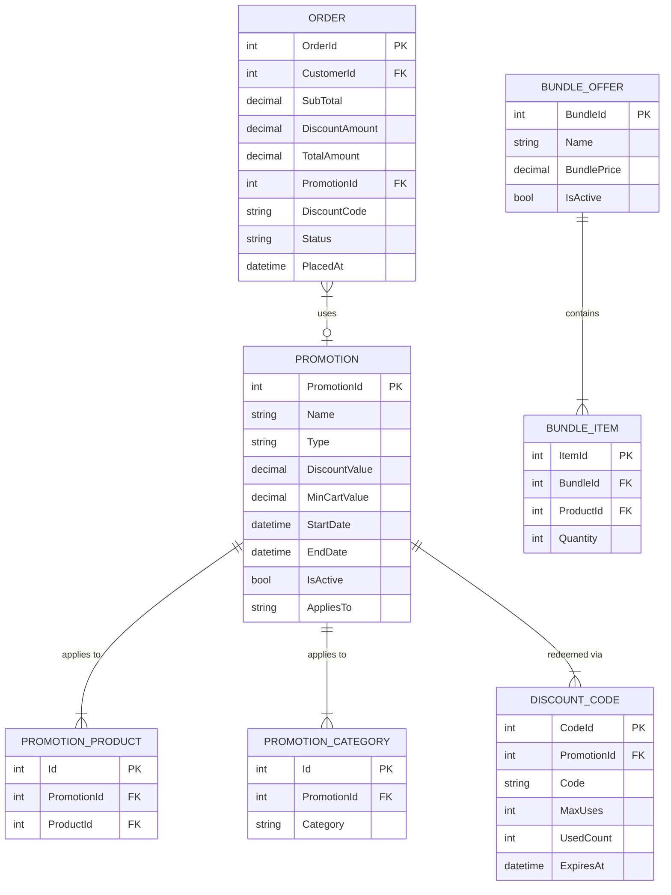

# E-Commerce Platform — Health & Wellness Products

> **Role:** Lead Developer
> **Domain:** E-Commerce · Health & Wellness · Retail · Online Payments
> **Stack:** .NET Framework · ASP.NET MVC · C# · jQuery · AJAX · SQL Server · Payment Gateway Integration · CSS · Bootstrap

---

## Overview

Developed a full-stack e-commerce platform for a health and wellness product retailer, enabling online product browsing, secure checkout, order management, and administrative control over inventory and sales. The platform includes a customer-facing storefront with a dynamic product catalogue, promotional features, and integrated online payment processing, alongside a comprehensive administrative portal.

While sharing foundational e-commerce patterns with other retail platforms, this project focused specifically on promotional mechanics — discount campaigns, bundle offers, and loyalty-oriented repeat purchase features — alongside a product content model suited to health and wellness retail, where usage context, certifications, and ingredient transparency are key purchase drivers.

---

## Business Problems Solved

The retailer had an established customer base through physical retail but no digital sales channel. Key problems addressed:

- **No online presence** — products available only in-store; no way to reach customers who discovered the brand through word-of-mouth or social channels but had no local store access.
- **No promotional tooling** — discount campaigns and bundle offers were communicated manually through printed flyers with no ability to apply them automatically at checkout.
- **Repeat purchase friction** — loyal customers had to remember and manually re-add frequently purchased products with no quick-reorder capability.
- **No sales performance visibility** — management had no data on which products sold most, which promotions drove conversion, or what the peak order periods were.
- **Manual inventory reconciliation** — stock levels maintained by physical counting with no connection to online sales deductions.

---

## What Was Built

### Product Catalogue
Category-based product browser with search, filter by health goal (immunity, fitness, nutrition, skincare), and sort options. Each product page includes certifications (organic, cruelty-free, GMP-certified), key ingredients, usage directions, and nutritional information where applicable. Product image gallery with multiple views per product.

### Promotional & Discount Engine
Configurable discount campaigns applied automatically at checkout based on rules: percentage discount, fixed-amount discount, minimum cart value threshold, and product/category-specific promotions. Bundle offer support — defined product combinations priced at a bundle rate with automatic detection at cart. Promotional banners on the storefront linked to active campaigns with scheduled start and end dates.

### Customer Storefront
Product discovery with featured and new arrival sections, category navigation, and search. AJAX cart with real-time promotion detection — discount applied and displayed as the cart is updated. Quick reorder from order history for repeat purchases. Wishlist with stock availability indicator.

### Checkout & Payment
Multi-step checkout with address management, delivery option selection, and payment. Online payment gateway integration with webhook-based order confirmation. Discount code entry at checkout with server-side validation against active promotion rules. Order summary with itemised discount breakdown before payment confirmation.

### Order Management
Order lifecycle from placement through confirmation, dispatch, and delivery with customer email notifications at each stage. Admin order queue with filter by status, date range, and customer. Dispatch note generation for fulfilment team. Return and exchange request handling.

### Inventory Management
Real-time stock deduction on order confirmation. Low-stock alerts per product variant. Out-of-stock display on storefront with optional back-in-stock notification signup for customers. Purchase order tracking for restocking.

### Admin Dashboard & Reporting
Sales summary by period, revenue by product category, promotion performance report (orders influenced, discount value issued, average order value with/without promotion), and inventory health overview.

---

## Customer & Promotion Flow

---

## Promotional Rules Model

---

## Key Technical Implementations

**Promotion evaluation engine** — cart-level promotion evaluation runs on every cart update; evaluates all active promotions in priority order, applies the best applicable promotion automatically, and resolves conflicts when multiple promotions could apply to the same cart.

**Bundle detection** — when items matching a defined bundle combination are all present in the cart, the bundle price is applied automatically with a line item showing the bundle discount; partial bundle matches surface a "complete the bundle" suggestion to the customer.

**Discount code validation** — server-side validation checks code existence, active status, expiry date, per-customer usage limit, and max total usage count atomically before applying to the order; race condition on last available use handled with optimistic concurrency check on the `UsedCount` field.

**Quick reorder** — order history surfaces a one-click reorder button per previous order; adds all items from the selected order to the current cart, skipping any out-of-stock variants with a notification to the customer.

**Back-in-stock notification** — customers can sign up for stock alerts on out-of-stock products; when stock is replenished above zero through a purchase order receipt, pending notification signups for that product are queued for email dispatch.

**Promotion performance reporting** — each order records the applied promotion ID and discount amount; promotion performance report aggregates orders-influenced count, total discount issued, and compares average order value for promoted vs non-promoted orders over the same period.

---

## Impact

| Area | Result |
|---|---|
| Sales Channel | Physical-only retailer launched to a fully operational online store |
| Promotional Automation | Discount campaigns applied automatically at checkout — no manual coupon handling |
| Repeat Purchase | Quick reorder from order history reduced friction for returning customers |
| Stock Accuracy | Real-time stock deduction on order confirmation replaced manual inventory counting |
| Promotion Insight | Promotion performance report gave management data to evaluate campaign ROI |
| Customer Communication | Automated order status notifications replaced manual customer follow-up calls |

---

## Patterns Applied

| Pattern | Application |
|---|---|
| **Rules Engine** | Promotion evaluation — ordered rule application with conflict resolution across active promotions |
| **Optimistic Concurrency** | Discount code usage count checked and incremented atomically to prevent over-redemption |
| **State Machine** | Order lifecycle through defined states with customer notification on each transition |
| **Observer** | Back-in-stock notification — stock replenishment event triggers pending customer alert dispatch |
| **MVC + Repository** | Controller → Service → Repository separation throughout |
| **AJAX Cart** | Client-side cart state synchronised with server on every interaction without full page reload |
