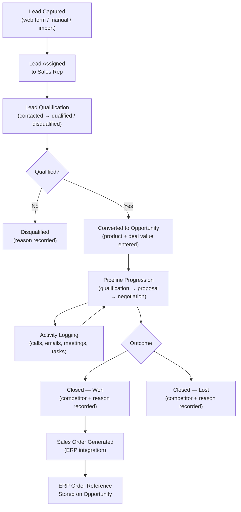
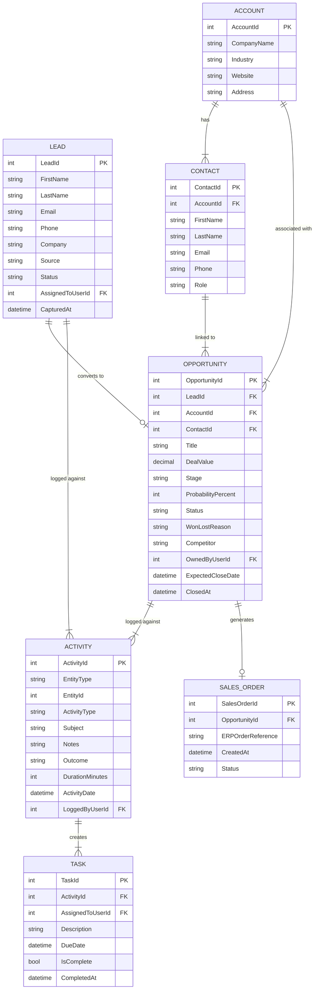

# Web CRM System

> **Role:** Software Engineer
> **Domain:** Customer Relationship Management · Sales Pipeline · ERP Integration
> **Stack:** .NET Framework · ASP.NET · C# · SQL Server · jQuery · JavaScript · AJAX

---

## Overview

Contributed to the development of a web-based Customer Relationship Management system enabling sales teams to manage leads, track customer interactions, log communications, progress opportunities through a sales pipeline, and generate sales orders integrated with an ERP system. The platform supported the complete sales lifecycle — from initial lead capture through opportunity management, customer engagement, and order creation.

Working as part of a development team, contributions focused on lead management, activity logging, opportunity progression workflows, and the sales order generation integration with the downstream ERP system.

---

## Business Problems Solved

The sales team operated without a unified system, managing leads and customer interactions across spreadsheets and email threads. Key problems addressed:

- **No centralised lead tracking** — leads from multiple sources captured in separate spreadsheets with no consolidated pipeline view or assignment management.
- **No interaction history** — call logs, meeting notes, and email follow-ups stored in individual inboxes with no shared, searchable record against a customer or lead.
- **No pipeline visibility** — sales managers had no real-time view of opportunities by stage, value, or owner; forecasting relied on manually compiled reports.
- **Manual sales order creation** — converting a won opportunity into a sales order required re-entering customer and product details into the ERP system; a time-consuming, error-prone duplication of effort.
- **No activity accountability** — no way to track whether follow-up actions from calls or meetings had been completed or were overdue.

---

## What Was Built / Contributed To

### Lead Management
Lead capture from multiple sources — web form submissions, manual entry, and import. Lead assignment to sales representatives with ownership tracking. Lead qualification workflow — new, contacted, qualified, and disqualified states with reason recording on disqualification. Duplicate detection on email and phone number at lead creation.

### Contact & Account Management
Customer contact profiles linked to company accounts. Relationship mapping — multiple contacts per account with role designation (decision maker, influencer, end user). Contact interaction timeline showing all logged activities, calls, and communications in chronological order.

### Activity Logging
Structured logging for calls, emails, meetings, and tasks against leads, contacts, or opportunities. Each activity carries a type, subject, notes, date, duration (for calls), and outcome. Follow-up task creation from activity log — outstanding tasks surfaced in the sales rep's daily task list with due date and overdue flagging.

### Opportunity Management
Lead-to-opportunity conversion with product and deal value entry. Sales pipeline with configurable stages — qualification, proposal, negotiation, and closed (won/lost). Probability weighting per stage used in revenue forecasting. Activity and note logging directly against opportunities. Won/lost recording with competitor and reason fields for pipeline analytics.

### Sales Order Generation
Won opportunities converted to sales orders via ERP integration — customer details, contact, line items, and pricing carried across from the opportunity record without re-entry. Integration with the ERP system via Web API call on order creation; order reference returned and stored against the opportunity for cross-system traceability.

### Reporting & Pipeline Analytics
Sales pipeline summary by stage, owner, and value. Activity report — calls made, meetings held, and tasks completed per representative per period. Won/lost analysis by reason, competitor, and product category. Revenue forecast from open opportunities weighted by stage probability.

---

## Sales Lifecycle Flow

---

## Data Model

---

## Key Technical Contributions

**Lead duplicate detection** — on lead creation, email address and phone number checked against existing lead and contact records; exact and fuzzy matches (normalised phone format comparison) surfaced to the user before saving, with the option to merge with an existing record or proceed as a new lead.

**Activity-to-task linkage** — follow-up tasks created during activity logging are linked back to the originating activity; the task list surfaces the activity context (what call or meeting the task arose from) alongside the task, giving sales reps the information needed to complete the follow-up without hunting for the original interaction record.

**Overdue task flagging** — tasks past their due date without a completion record flagged in the sales rep dashboard and in the manager's team activity view; flagging computed at query time against the current date rather than stored as a status field, avoiding the need for a background job to update task state.

**Pipeline stage probability weighting** — each pipeline stage carries a configurable probability percentage; revenue forecast computed as the sum of `DealValue × ProbabilityPercent` across all open opportunities, grouped by owner and period. Probability values configurable by sales managers without code changes.

**ERP sales order integration** — on opportunity close-won, a sales order payload assembled from the opportunity, account, contact, and line item records and submitted to the ERP Web API; ERP order reference returned and persisted against the opportunity for cross-system traceability; integration failure handled gracefully with retry capability from the opportunity record without requiring manual re-entry.

**Activity timeline aggregation** — contact and opportunity detail pages surface a unified chronological timeline of all activities, tasks, and notes regardless of activity type; implemented as a single UNION query across activity types sorted by date, avoiding multiple per-type API calls from the frontend.

---

## Impact

| Area | Result |
|---|---|
| Pipeline Visibility | Sales managers gained a real-time view of all opportunities by stage, owner, and value — replacing manual spreadsheet reports |
| Interaction History | All calls, meetings, and emails logged against a unified contact record — full customer interaction history accessible to any team member |
| Follow-Up Accountability | Task creation from activity logging and overdue flagging ensured follow-up actions were tracked and visible to managers |
| Order Creation Efficiency | ERP integration eliminated manual re-entry of customer and product data when converting won opportunities to sales orders |
| Sales Forecasting | Probability-weighted pipeline forecast gave management a data-driven revenue projection across the sales team |

---

## Patterns Applied

| Pattern | Application |
|---|---|
| **State Machine** | Lead qualification and opportunity pipeline progression through defined stages with valid transitions |
| **Fuzzy Matching** | Phone number normalisation and comparison for lead duplicate detection |
| **Derived State** | Overdue task status computed at query time from due date vs current date — no background job required |
| **Configuration-Driven Probability** | Stage probability weights stored in configuration — adjustable by sales managers without deployment |
| **Integration with Retry** | ERP sales order creation failure handled with stored retry capability from the opportunity record |
| **Timeline Aggregation** | UNION query across activity types produces a unified chronological interaction timeline per entity |